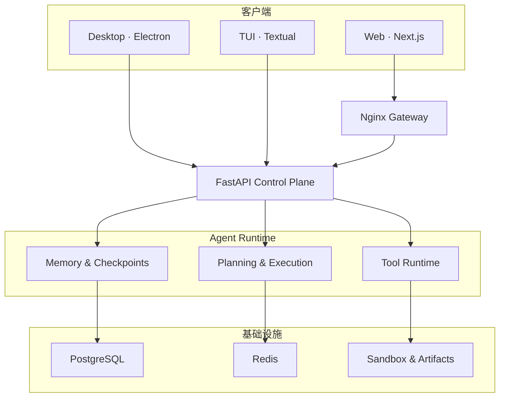

<div align="center">

# AtlasAgent

### 可追溯、可恢复、可审计的 AI Agent 控制平面

从会话事件到长期记忆，从工具授权到 Checkpoint 恢复——用一套完整工程理解并构建生产级 Agent 系统。

[](https://www.python.org/)
[](https://fastapi.tiangolo.com/)
[](https://nextjs.org/)
[](https://www.electronjs.org/)
[](https://textual.textualize.io/)
[](https://docs.docker.com/compose/)

[快速开始](#快速开始) · [核心能力](#核心能力) · [系统架构](#系统架构) · [客户端](#三个客户端) · [完整教程](tutorial/README.md)

</div>

---

## 项目定位

AtlasAgent 是一个全栈 AI Agent 工程与配套教程。它不只演示“让模型调用几个工具”，而是把 Agent 运行过程中最难处理的边界做成可运行的控制平面：**事实从哪里来、状态如何恢复、记忆为什么可信、工具何时允许执行，以及每一步如何审计。**

项目同时提供 Web、Electron 桌面端与键盘优先 TUI，并包含从基础 API 到 Memory / Tool Control Plane 的 **0–73 章中文教程**。

> [!NOTE]
> 当前版本是在课程 0–68 章基础上的 Control Plane 升级版。旧版 API 与 Web 工作流继续可用，新能力对应教程第 69–73 章。

## 核心能力

| 能力 | 解决的问题 | 实现要点 |
| --- | --- | --- |
| **Evidence-backed Memory** | 避免把过期、冲突或无来源的信息注入上下文 | 类型化记忆、Write Gate、证据链、作用域、有效期、替代关系、可解释检索 |
| **Checkpoint DAG** | 让长任务能够安全暂停、恢复和回溯 | 父子 Checkpoint、事件覆盖区间、状态哈希、环境指纹、校验报告 |
| **Unified Tool Runtime** | 防止工具绕过权限、重复产生副作用或留下审计盲区 | 风险分级、权限策略、审批、幂等、超时、脱敏、大输出制品化、全程审计 |
| **Artifact Store** | 让日志、补丁、截图和测试报告成为稳定事实源 | SHA-256 内容寻址、来源引用、任务与 Checkpoint 关联 |
| **Multi-client Workspace** | 覆盖浏览器、桌面驻留与 SSH/低带宽场景 | Next.js Web、Electron 时间线工作台、Textual TUI，共用 FastAPI 接口 |
| **Isolated Sandbox** | 隔离文件、Shell 与浏览器自动化 | 独立服务、工作区限制、输出限制、VNC / noVNC、统一网关 |

## 系统架构



控制平面的核心原则是：**原始事件与 Artifact 是事实源，任务状态是可重建的物化视图，Checkpoint 是经过验证的恢复点。**

## 快速开始

### 使用 Docker Compose

需要 Git、Docker 与 Docker Compose v2。

```bash
git clone https://github.com/malevrigns/atlas-agent-control-plane.git
cd atlas-agent-control-plane
cp .env.example .env
BUILD=true ./scripts/start.sh
```

启动后访问：

- Web 工作台：<http://localhost:8088>
- API 健康检查：<http://localhost:8088/api/status>
- 数据库状态：<http://localhost:8088/api/status/database>

Windows PowerShell 可直接使用：

```powershell
Copy-Item .env.example .env
docker compose up -d --build
```

再次启动不需要重新构建：

```bash
./scripts/start.sh
```

停止服务：

```bash
./scripts/stop.sh
```

如需同时清理 PostgreSQL、Redis 与上传文件卷：

```bash
CLEAN_VOLUMES=true ./scripts/stop.sh
```

> [!TIP]
> 默认网关端口为 `8088`。端口冲突时可设置 `NGINX_PORT=18088` 后重新启动。

### 本地开发

| 模块 | 启动命令 | 默认地址 / 行为 |
| --- | --- | --- |
| API | `cd api && uv sync && uv run uvicorn app.main:app --reload` | `http://localhost:8000` |
| Web | `cd ui && pnpm install && pnpm dev` | `http://localhost:3000` |
| Desktop | `cd desktop && npm install && npm run electron:dev` | Electron 桌面窗口 |
| TUI | `cd tui && uv sync && ATLAS_API_URL=http://localhost:8000 uv run atlas-tui` | 后端不可达时自动进入演示模式 |

本地启动 API 前，需要先准备 PostgreSQL 与 Redis：

```bash
docker compose up -d postgres redis
```

## 三个客户端

| 客户端 | 最适合 | 特色 |
| --- | --- | --- |
| **Web** | 浏览器协作与完整功能体验 | 会话、文件、Sandbox、设置、MCP、A2A 与 Agent 工作流 |
| **Desktop** | 长时间驻留与多面板观察 | Checkpoint 时间线、工具审计、暂停/恢复、Ink / Dawn / Contrast 三主题 |
| **TUI** | SSH、低带宽与键盘工作流 | 任务 / Checkpoint / 审计三栏、快捷键、三套终端主题、离线演示数据 |

桌面端默认启用 `contextIsolation` 并关闭 `nodeIntegration`；主题选择会在本地持久化。TUI 的常用快捷键与客户端配置见 [客户端指南](docs/CLIENTS.md)。

## Control Plane 工作流

### 1. 创建结构化任务

```bash
curl -X POST http://localhost:8000/api/control-plane/tasks \
  -H "Content-Type: application/json" \
  -d '{
    "title": "更新交付物",
    "goal": "完成可验证升级",
    "acceptance_criteria": ["测试通过"],
    "project_id": "atlas"
  }'
```

### 2. 通过统一 Runtime 调用工具

```bash
curl -X POST http://localhost:8000/api/agent-core/tools/draft_plan/invoke \
  -H "Content-Type: application/json" \
  -d '{
    "arguments": {"task": "检查交付质量"},
    "project_id": "atlas",
    "allowed_permissions": [],
    "idempotency_key": "demo-001"
  }'
```

### 3. 查询工具审计

```bash
curl "http://localhost:8000/api/control-plane/tool-invocations?project_id=atlas"
```

完整的数据模型、生命周期和接口说明见 [Memory 与 Tool Control Plane](docs/MEMORY_TOOL_CONTROL_PLANE.md)。

## 项目结构

```text
atlas-agent-control-plane/
├── api/          FastAPI 后端、迁移、Control Plane 与测试
├── ui/           Next.js Web 客户端
├── desktop/      Electron 桌面客户端
├── tui/          Textual 终端客户端
├── sandbox/      文件、Shell、浏览器与 VNC 沙箱服务
├── nginx/        统一网关配置
├── docs/         Control Plane 与客户端专题文档
├── tutorial/     0–73 章中文教程与配套图片
├── scripts/      一键启动和停止脚本
└── docker-compose.yml
```

进一步阅读：

- [整体架构](ARCHITECTURE.md)
- [API 架构](api/ARCHITECTURE.md)
- [API 依赖说明](api/DEPENDENCIES.md)
- [Memory / Tool Control Plane](docs/MEMORY_TOOL_CONTROL_PLANE.md)
- [Web、Desktop 与 TUI 客户端](docs/CLIENTS.md)
- [完整课程目录](tutorial/README.md)

## 验证

```bash
# 后端测试
cd api
uv run python -m unittest discover -s tests

# TUI 测试
cd ../tui
uv run python -m unittest discover -s tests

# Desktop 构建与打包适配测试
cd ../desktop
npm run build
npm run test:sites
```

当前交付基线已通过：

- 后端：38 项测试
- TUI：3 项测试
- Desktop：构建成功，4 项打包适配测试
- OpenAPI：72 条路径成功生成
- Alembic：完整迁移链可生成离线 SQL

## 配置

服务端常用配置集中在根目录的 [`.env.example`](.env.example)：

- `LLM_API_KEY`：模型服务密钥；未配置时仍可使用不依赖模型的演示与控制平面能力
- `NGINX_PORT`：统一网关端口，默认 `8088`
- `TOOL_AUTO_APPROVE_RISK`：工具自动批准的最高风险等级
- `TOOL_DEFAULT_TIMEOUT_SECONDS`：工具默认超时
- `TOOL_OUTPUT_INLINE_LIMIT`：大输出转为 Artifact 的阈值

客户端地址分别通过 `VITE_ATLAS_API_BASE`（Electron）和 `ATLAS_API_URL`（TUI）设置。

> [!IMPORTANT]
> 不要提交真实 `.env`、模型密钥或第三方服务凭据。生产环境应收紧 CORS、工具权限、自动审批阈值与 Sandbox 网络策略。

## 教程路线

教程从最小可运行服务逐步演进到完整控制平面：

1. FastAPI、Next.js、PostgreSQL 与 Redis 基础
2. 会话、流式消息、文件与上下文工程
3. Agent 规划执行、工具、MCP、A2A 与多 Agent 协作
4. Sandbox、浏览器自动化、可观测性、安全与 Harness
5. 类型化 Memory、Checkpoint DAG、Tool Runtime、Electron 与 TUI

从 [教程首页](tutorial/README.md) 开始，或直接阅读 [Control Plane 升级说明](docs/MEMORY_TOOL_CONTROL_PLANE.md)。

---

<div align="center">

**AtlasAgent · Build agents that can explain what they know, what they did, and how to recover.**

</div>
