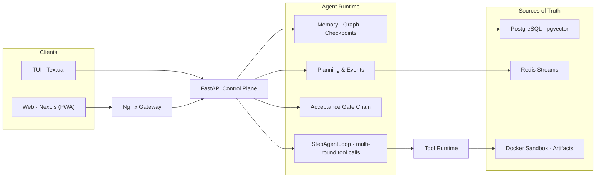

<div align="center">


<br>

<a href="https://github.com/malevrigns/atlas-agent-control-plane/stargazers"></a>
<a href="https://github.com/malevrigns/atlas-agent-control-plane/actions"></a>
<a href="LICENSE"></a>
<a href="#"></a>

**Trace what agents know. Control what they do. Recover with proof.**

[English](#-english) · [中文](#-中文) · [64-chapter tutorial](tutorial/README.md) · [Architecture](ARCHITECTURE.md)

</div>

---

<a id="-english"></a>

## 🇬🇧 English

Production agents break in the same four places, every time:

> *"Where did this fact come from?"* — memory without provenance is a hallucination factory.
> *"Why was this tool allowed to run?"* — ungoverned tool calls are incidents waiting to happen.
> *"The task died at step 38. Can we resume from 17?"* — unrecoverable long tasks are time bombs.
> *"What exactly did the agent do at 3am?"* — autonomous execution without audit is unauditable, literally.

**AtlasAgent treats these as architecture, not plugins.** One FastAPI control plane, a Next.js PWA + Textual TUI client pair, and a 64-chapter tutorial that rebuilds everything from an empty directory.

<br>

### The six control boundaries

| | |
|:---|:---|
| 🧠 **Evidence-backed memory** | Facts pass a write gate before reaching the model — source-linked, scoped, TTL'd. Plus Ebbinghaus decay, consolidation, conflict resolution, and a typed memory graph. |
| 🔎 **RAG with receipts** | Query rewriting → multi-query RRF fusion → parent-document retrieval → LLM reranking with lexical fallback. Every citation carries a confidence score; every query writes a retrieval trace. |
| ⚖️ **Governed tool runtime** | Risk tiers → approval → idempotency → timeout → redaction → artifact store. A handler only runs after the gate says yes. Result caching, dependency-aware batching, retry with fallback, per-step budgets. |
| 🛡️ **Task boundary enforcement** | Before a task can complete: an acceptance command (exit 0 = done), a scope audit (files the plan declared), and an LLM coverage review. Three gates, one shared retry budget. |
| 💾 **Checkpoint DAG** | State hashes + environment fingerprints. Task dies at step 38? Resume from 17 — don't re-run the plan. |
| 📡 **Auditable by default** | Raw events are the source of truth; task state is a rebuildable view. Every tool call, memory write, and retrieval is a queryable record. |

<br>

### What a governed step looks like

```text
                    ┌───────────── PLAN ─────────────┐
                    │  goal + acceptance command     │
                    │  scope: allowed/forbidden globs│
                    └───────────────┬────────────────┘
                                    ▼
   ┌────────── EXECUTE ──────────┐
   │ StepAgentLoop: multi-round  │        every step emits
   │ tool calls w/ budget        │────────▶  step_started
   │ risk ▸ approval ▸ idempotency│          tool_called
   └──────────────┬──────────────┘          artifacts
                  ▼
   ┌────────── REFLECT ──────────┐
   │ critic: accept / retry /    │        step_reflected
   │ replan / fail               │
   └──────────────┬──────────────┘
                  ▼
   ╔═════════ ACCEPTANCE GATES ════════════════════╗
   ║ ① verify:   run acceptance cmd  ── exit 0?    ║
   ║ ② scope:    diff vs plan globs  ── in bounds? ║     any gate fails
   ║ ③ coverage: LLM reviews tests   ── complete?  ║ ───▶ retry (budget 2)
   ╚═════════════════════┬═════════════════════════╝      or FAILED
                         ▼ all pass
   ┌────────── SUMMARIZE ────────┐
   │ answer strictly from        │────────▶  task_done ✓
   │ observed tool evidence      │
   └─────────────────────────────┘
```

<details>
<summary><strong>System topology</strong></summary>
<br>



</details>

### Quick start

```bash
git clone https://github.com/malevrigns/atlas-agent-control-plane.git
cd atlas-agent-control-plane && cp .env.example .env
BUILD=true ./scripts/start.sh
# → http://localhost:8088   (Web workbench + API gateway)
```

Works with **any OpenAI-compatible endpoint** — DeepSeek, Qwen, DashScope, Ollama. No key? It still boots: local hash embeddings power an offline demo mode.

> [!TIP]
> Port 8088 taken? `NGINX_PORT=18088` and restart. On Windows, use Git Bash or WSL with Docker integration.

<details>
<summary><strong>Query the control plane directly</strong></summary>

```bash
ATLAS_KEY="$(sed -n 's/^ATLAS_API_KEY=//p' .env)"

# 1. Create a structured task with its acceptance command
curl -X POST http://localhost:8088/api/control-plane/tasks \
  -H "X-Atlas-API-Key: ${ATLAS_KEY}" -H "Content-Type: application/json" \
  -d '{"title": "Upgrade deps", "goal": "Verifiable upgrade",
       "acceptance_criteria": ["pytest exits 0"], "project_id": "atlas"}'

# 2. Invoke a tool — risk, approval & idempotency enforced first
curl -X POST http://localhost:8088/api/agent-core/tools/draft_plan/invoke \
  -H "X-Atlas-API-Key: ${ATLAS_KEY}" -H "Content-Type: application/json" \
  -d '{"arguments": {"task": "Check delivery quality"}, "project_id": "atlas",
       "idempotency_key": "demo-001"}'

# 3. Every invocation left a queryable audit trail
curl -H "X-Atlas-API-Key: ${ATLAS_KEY}" \
  "http://localhost:8088/api/control-plane/tool-invocations?project_id=atlas"
```

Full API reference: [Memory & Tool Control Plane](docs/MEMORY_TOOL_CONTROL_PLANE.md) · [RAG & Skills](docs/RAG_AND_SKILLS.md)

</details>

<details>
<summary><strong>Configuration & security notes</strong></summary>

| Variable | Purpose |
| --- | --- |
| `LLM_API_KEY` | Model key — optional; everything runs without it. Any OpenAI-compatible base URL in `backend/api/config/llm.yaml` |
| `ATLAS_API_KEY` | Control-plane + sandbox shared key (auto-generated by start script) |
| `RAG_VECTOR_BACKEND` | `pgvector` (default) or `qdrant` |
| `RAG_EMBEDDING_PROVIDER` | `auto`, or `local_hash` to force offline embeddings |
| `TOOL_AUTO_APPROVE_RISK` | Highest risk tier auto-approved |
| `NGINX_PORT` / `NGINX_HOST` | Gateway port (default 8088) / bind address (default 127.0.0.1) |

> [!IMPORTANT]
> The built-in API key is a single-tenant boundary. Internet-facing deployments need TLS, OIDC/RBAC, and rate limiting in front. MCP and A2A transports are off or allowlist-only by default.

</details>

<details>
<summary><strong>Local development</strong></summary>

```bash
docker compose up -d postgres redis        # infra first
```

| Module | Command |
| --- | --- |
| API | `cd backend/api && uv sync && uv run uvicorn app.main:app --reload` |
| Web | `cd frontend/web && pnpm install && pnpm dev` |
| TUI | `cd frontend/tui && uv sync && ATLAS_API_URL=http://localhost:8000 uv run atlas-tui` |
| Sandbox | `cd backend/sandbox && docker build -t atlas-sandbox . && docker run -d -p 8100:8100 atlas-sandbox` |

```bash
cd backend/api    && uv run python -m unittest discover -s tests   # 456 tests
cd frontend/tui   && uv run python -m unittest discover -s tests
cd frontend/web   && pnpm typecheck && pnpm build
```

</details>

### 📖 The tutorial is the differentiator

**64 chapters. 62,000+ lines.** From `docker compose up` to a full control plane — every layer hand-built, every trade-off written down, every chapter with goals, runnable code, and acceptance criteria.

Highlights: [27 · long-term memory](tutorial/chapters/27-长期记忆与上下文注入.md) · [45 · Memory Control Plane & Checkpoint DAG](tutorial/chapters/45-Memory%20Control%20Plane%20与%20Checkpoint%20DAG.md) · [46 · Tool Runtime: permissions, idempotency, audit](tutorial/chapters/46-Tool%20Runtime%20权限、幂等与审计.md) · [50 · RAG](tutorial/chapters/50-RAG%20检索增强生成与知识库.md) · [57 · query expansion & hybrid reranking](tutorial/chapters/57-查询扩展与混合重排.md) · [61 · acceptance gates & task boundaries](tutorial/chapters/61-验收门禁与任务边界.md)

Think of it as *build your own Dify — and understand every line.*

### Project layout

```text
atlas-agent-control-plane/
├── frontend/
│   ├── web/        Next.js client (PWA)
│   └── tui/        Textual terminal client
├── backend/
│   ├── api/        FastAPI control plane · migrations · 456 tests
│   └── sandbox/    Isolated files / shell / browser / VNC
├── docs/           Deep-dive documentation
├── tutorial/       64-chapter engineering tutorial
├── scripts/        start.sh / stop.sh
└── docker-compose.yml
```

### Contributing

Issues and PRs welcome — see [CONTRIBUTING.md](CONTRIBUTING.md). Run tests before submitting; never commit real keys or `.env`.

---

<a id="-中文"></a>

## 🇨🇳 中文

生产环境的 Agent 总在同样四个地方翻车：

> **这条事实从哪来的？** —— 记忆没有来源，就是幻觉温床。
> **这个工具凭什么被执行了？** —— 没有治理的工具调用，是生产事故预备役。
> **任务死在第 38 步，能从第 17 步恢复吗？** —— 不能恢复的长任务是定时炸弹。
> **凌晨 3 点 Agent 到底干了什么？** —— 没有审计的自主执行，没人敢让它上线。

**AtlasAgent 把这四个问题当第一性架构约束，而不是事后补丁。** 一套 FastAPI 控制平面 + Next.js PWA / Textual TUI 双客户端，附 64 章从空目录开始重造全系统的中文工程教程。

### 六个控制边界

| | |
|:---|:---|
| 🧠 **证据记忆** | 事实先过写入门禁才到模型——来源、作用域、有效期俱全；叠加艾宾浩斯衰减、自动巩固、冲突消解、类型化记忆图谱 |
| 🔎 **带收据的 RAG** | 查询改写 → 多查询 RRF 融合 → 父文档检索 → LLM 重排（词法降级）。每条引用带置信度，每次检索落审计 |
| ⚖️ **受治理的工具运行时** | 风险分级 → 审批 → 幂等 → 超时 → 脱敏 → 制品化。门禁说可以，handler 才执行。另有结果缓存、依赖分批、重试降级、步骤预算 |
| 🛡️ **任务边界门禁** | 任务要完成必须过三关：验收命令（exit 0 = 完成）、范围审计（只改计划声明的文件）、覆盖度评审（LLM 检验测试完全性）。三关共享重试额度 |
| 💾 **Checkpoint DAG** | 状态哈希 + 环境指纹。第 38 步挂了？从第 17 步恢复，不用重跑整个计划 |
| 📡 **默认可审计** | 原始事件是唯一事实源，任务状态只是可重建的视图。每次工具调用、记忆写入、检索都有可查询记录 |

### 一次受治理的执行长什么样

```text
                    ┌───────────── 规划 ─────────────┐
                    │  目标 + 验收命令 + 范围声明      │
                    └───────────────┬────────────────┘
                                    ▼
   ┌────────── 执行 ─────────────┐
   │ StepAgentLoop：步骤内多轮    │        每步产生
   │ 工具调用（预算内）           │──────▶  step_started
   │ 风险 ▸ 审批 ▸ 幂等           │        tool_called
   └──────────────┬──────────────┘        artifacts
                  ▼
   ┌────────── 反思 ─────────────┐
   │ critic：accept / retry /    │        step_reflected
   │ replan / fail               │
   └──────────────┬──────────────┘
                  ▼
   ╔══════════ 验收门禁链 ═════════════════════════╗
   ║ ① 验证：跑验收命令 ──── exit 0？               ║
   ║ ② 范围：diff 对比计划 glob ── 未越界？         ║   任一关失败
   ║ ③ 覆盖：LLM 评审测试 ──── 覆盖完全？           ║ ──▶ retry（额度 2 次）
   ╚══════════════════════┬════════════════════════╝       或 FAILED
                         ▼ 全部通过
   ┌────────── 总结 ─────────────┐
   │ 只依据已观察到的工具证据作答  │──────▶  task_done ✓
   └─────────────────────────────┘
```

### 快速开始

```bash
git clone https://github.com/malevrigns/atlas-agent-control-plane.git
cd atlas-agent-control-plane && cp .env.example .env
BUILD=true ./scripts/start.sh
# → http://localhost:8088   (Web 工作台 + API 网关)
```

**任何 OpenAI 兼容接口都能接**——DeepSeek、Qwen、DashScope、Ollama。没配密钥也能跑：本地哈希 embedding 撑起离线演示模式。

> [!TIP]
> 端口冲突：`NGINX_PORT=18088` 后重启。Windows 用 Git Bash 或已启用 Docker 集成的 WSL。

<details>
<summary><strong>直接调用控制平面</strong></summary>

```bash
ATLAS_KEY="$(sed -n 's/^ATLAS_API_KEY=//p' .env)"

# 1. 创建带验收命令的结构化任务
curl -X POST http://localhost:8088/api/control-plane/tasks \
  -H "X-Atlas-API-Key: ${ATLAS_KEY}" -H "Content-Type: application/json" \
  -d '{"title": "升级依赖", "goal": "可验证升级",
       "acceptance_criteria": ["pytest 退出码 0"], "project_id": "atlas"}'

# 2. 调工具——先过风险/审批/幂等检查
curl -X POST http://localhost:8088/api/agent-core/tools/draft_plan/invoke \
  -H "X-Atlas-API-Key: ${ATLAS_KEY}" -H "Content-Type: application/json" \
  -d '{"arguments": {"task": "检查交付质量"}, "project_id": "atlas",
       "idempotency_key": "demo-001"}'

# 3. 每次调用都留下可查询的审计记录
curl -H "X-Atlas-API-Key: ${ATLAS_KEY}" \
  "http://localhost:8088/api/control-plane/tool-invocations?project_id=atlas"
```

完整接口：[Memory 与 Tool Control Plane](docs/MEMORY_TOOL_CONTROL_PLANE.md) · [RAG 与 Skill 注册中心](docs/RAG_AND_SKILLS.md)

</details>

<details>
<summary><strong>配置与安全</strong></summary>

| 变量 | 用途 |
| --- | --- |
| `LLM_API_KEY` | 模型密钥——可选，没配也能跑全部演示。OpenAI 兼容 base_url 配在 `backend/api/config/llm.yaml` |
| `ATLAS_API_KEY` | 控制平面 + Sandbox 共享密钥（启动脚本自动生成） |
| `RAG_VECTOR_BACKEND` | `pgvector`（默认）或 `qdrant` |
| `RAG_EMBEDDING_PROVIDER` | `auto`，或 `local_hash` 强制离线向量 |
| `TOOL_AUTO_APPROVE_RISK` | 自动批准的最高风险等级 |
| `NGINX_PORT` / `NGINX_HOST` | 网关端口（默认 8088）/ 绑定地址（默认 127.0.0.1） |

> [!IMPORTANT]
> 内置 API Key 是单租户边界。公网多用户部署需在网关前接入 TLS、OIDC/RBAC 与限流。MCP 与 A2A 传输默认关闭或仅白名单。

</details>

<details>
<summary><strong>本地开发</strong></summary>

```bash
docker compose up -d postgres redis        # 先起基础设施
```

| 模块 | 命令 |
| --- | --- |
| API | `cd backend/api && uv sync && uv run uvicorn app.main:app --reload` |
| Web | `cd frontend/web && pnpm install && pnpm dev` |
| TUI | `cd frontend/tui && uv sync && ATLAS_API_URL=http://localhost:8000 uv run atlas-tui` |
| Sandbox | `cd backend/sandbox && docker build -t atlas-sandbox . && docker run -d -p 8100:8100 atlas-sandbox` |

```bash
cd backend/api    && uv run python -m unittest discover -s tests   # 456 个测试
cd frontend/tui   && uv run python -m unittest discover -s tests
cd frontend/web   && pnpm typecheck && pnpm build
```

</details>

### 📖 教程是最大的差异化

**64 章 · 62000+ 行**。从 `docker compose up` 一路写到完整控制平面——每一层亲手造、每个取舍写清楚，每章都有目标、可运行代码和验收标准。

精选章节：[27 · 长期记忆与上下文注入](tutorial/chapters/27-长期记忆与上下文注入.md) · [45 · Memory Control Plane 与 Checkpoint DAG](tutorial/chapters/45-Memory%20Control%20Plane%20与%20Checkpoint%20DAG.md) · [46 · Tool Runtime 权限、幂等与审计](tutorial/chapters/46-Tool%20Runtime%20权限、幂等与审计.md) · [50 · RAG](tutorial/chapters/50-RAG%20检索增强生成与知识库.md) · [57 · 查询扩展与混合重排](tutorial/chapters/57-查询扩展与混合重排.md) · [61 · 验收门禁与任务边界](tutorial/chapters/61-验收门禁与任务边界.md)

一句话：**亲手造一个 Dify，而且每一行你都懂。**

### 项目结构

```text
atlas-agent-control-plane/
├── frontend/
│   ├── web/        Next.js 客户端（PWA）
│   └── tui/        Textual 终端客户端
├── backend/
│   ├── api/        FastAPI 控制平面 · 迁移 · 456 个测试
│   └── sandbox/    文件 / Shell / 浏览器 / VNC 隔离执行
├── docs/           专题深潜文档
├── tutorial/       64 章中文工程教程
├── scripts/        start.sh / stop.sh
└── docker-compose.yml
```

### 贡献

欢迎 Issue 与 PR——流程见 [CONTRIBUTING.md](CONTRIBUTING.md)。提交前跑测试；不要提交真实密钥与 `.env`。

---

<div align="center">

<sub><strong>AtlasAgent</strong> — Build agents that can explain what they know, what they did, and how to recover.</sub>

</div>
