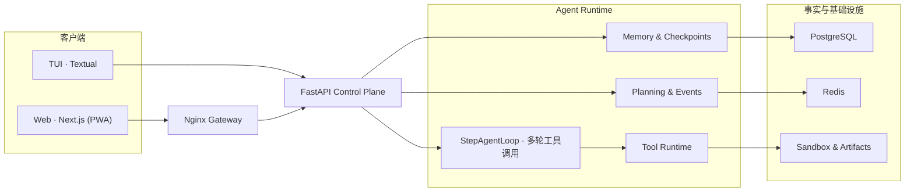

<p align="center">
  
</p>

<div align="center">

# 🚀 AtlasAgent · 可审计的 AI Agent 控制平面

<a href="https://github.com/malevrigns/atlas-agent-control-plane"></a>
<a href="LICENSE"></a>
<a href="#"></a>
<a href="#"></a>
<a href="#"></a>

**From chat apps to controllable systems** — every fact traceable, every memory trustworthy, every tool governed, every task recoverable, every step auditable.
**把 Agent 从会话应用升级为可控系统** —— 事实可溯源、记忆可信、工具受治理、任务可恢复、每一步可审计。

⭐ **If AtlasAgent saves you time, a star is the simplest way to say thanks** — and it genuinely helps more developers find the project.

[English](#english) | [中文](#中文)

[快速开始](#-快速开始) · [核心能力](#-核心能力) · [运行机制](#-运行机制) · [客户端](#-客户端) · [完整教程](tutorial/README.md)

</div>

---

## English

### What is AtlasAgent?

AtlasAgent is a **production-ready control plane for AI agents**. It puts raw events, long-term memory, RAG retrieval, skill guidance, tool invocations, artifacts, and checkpoints on a single traceable chain, and governs the six boundaries where agent systems actually break in production: **where facts come from, why memory is trustworthy, whether citations are traceable, when a tool is allowed to run, how a failed task recovers, and how every step gets audited.**

One FastAPI control plane serves both a Next.js web app (PWA) and a Textual TUI. The repo also ships a **55-chapter engineering tutorial** that rebuilds the entire system from an empty directory, up to the Memory / RAG / Skill / Tool Control Plane.

### Why AtlasAgent?

Frameworks like LangChain are great for wiring LLM features together quickly. AtlasAgent takes the opposite bet: in production, "it works" is not enough — you need to explain what the agent knows, prove what it did, and recover when it fails. That's what AtlasAgent optimizes for: **auditable** (every tool call, memory write, and evidence citation is a queryable first-class record), **governable** (tools pass through a unified runtime with risk tiers, approval, idempotency, and sandboxing — not loose function calls), and **recoverable** (long tasks leave behind a verified checkpoint DAG you can resume from, instead of re-running the whole plan).

### 🎉 What's New

- [2026.08] 🎯 **Next-generation RAG**: query rewriting with multi-query RRF fusion, parent-document retrieval, LLM listwise reranking with graceful lexical fallback, and per-citation confidence scores — every answer now shows how much to trust it.
- [2026.08] 🎯 **Living memory**: Ebbinghaus-style decay, automatic consolidation of frequently-verified facts, conflict resolution (latest/authority/manual), and a typed memory graph that pulls related facts into context — memory that forgets like you do, and connects like you need.
- [2026.08] 🎯 **Hardened tool runtime**: result caching for idempotent low-risk calls, dependency-aware parallel batching, exponential-backoff retries with fallback tools, and per-step budgets that hand control back to the model instead of throwing.
- [2026.08] 🎯 **Multi-round tool calling inside a single step + native Function Calling**: the model now calls tools repeatedly within one step, observes the results, and decides what to do next — the way a real agent works.
- [2026.08] 🎯 **Web client is now a PWA**: installable on desktop and mobile with an offline app shell; the Electron desktop client is retired in favor of a focused Web + TUI pair.
- [2026.08] 🎯 **Resume failed tasks from a checkpoint**: reuse the existing plan, skip completed steps, and continue from the failure point — no re-running from scratch.
- [2026.08] 🎯 **Direct-answer routing + live reasoning**: ordinary questions stream straight through, and the thinking process is streamed live and replayable afterwards.
- [2026.08] 🎯 **Automatic knowledge-base recall with cited answers**: every turn recalls relevant documents and attributes its sources.
- [2026.08] 🎯 **Web-page reading + tool self-healing**: the agent can now read real page content and recover from flaky tool calls.

### ✨ Core Capabilities

<p align="center">
  
</p>

| Boundary | How AtlasAgent handles it | Key mechanisms |
| --- | --- | --- |
| **Evidence-backed Memory** | Only facts that are still valid, source-attributed, and passed the write gate are injected into context | Typed memory, Write Gate, evidence chains, scopes, TTL, supersession, Ebbinghaus decay, consolidation, conflict resolution, memory graph links, usage tracking, explainable retrieval |
| **RAG Knowledge Base** | Makes team documents a retrievable, citable, verifiable source of evidence | Chunking with overlap, swappable vector backends (pgvector / Qdrant), query rewriting + multi-query RRF fusion, parent-document retrieval, LLM reranking with lexical fallback, numbered citations with confidence scores, retrieval audit, multimodal ingestion, per-turn auto-recall with source attribution |
| **Transparent Reasoning** | Surfaces the model's thinking and answering process live | Direct-answer vs. pipeline routing, plan/execute/direct thinking deltas, reasoning persisted for replay, throttled typewriter rendering |
| **Multi-round Tool Calling** | The model calls tools repeatedly inside a step and decides after observing results | Native Function Calling, JSON fallback, concurrent tool execution, duplicate-call guardrails |
| **Skill Registry** | Turns team operating playbooks into governed, traceable behavior specs | draft/published/deprecated lifecycle, semver versions, enable/disable decoupling, relevance-based injection |
| **Checkpoint DAG** | Verifiable pause, resume, and rollback points for long tasks | Parent-child checkpoints, event ranges, state hashes, environment fingerprints, verification reports |
| **Unified Tool Runtime** | Constrains permissions and side effects before the handler runs | Risk tiers, approval, idempotency, timeouts, redaction, artifactizing large outputs, full audit trail |
| **Artifact Store** | Makes logs, patches, screenshots, and reports stable sources of truth | SHA-256 content addressing, provenance references, task and checkpoint linkage |
| **Multi-client Workspace** | Observe the same running state from a browser or over SSH | Next.js Web (PWA), Textual TUI, shared FastAPI surface |
| **Isolated Sandbox** | Confines file, shell, and browser automation to its own runtime boundary | Workspace limits, output limits, web-page reading, VNC / noVNC, unified gateway |

### 🏗️ How It Works

The control plane's ordering of truth is explicit: **raw events and artifacts are the source of truth, task state is a rebuildable materialized view, and a checkpoint is a verified recovery point.**

A task moves along this chain:

1. A structured task is created with a goal and acceptance criteria.
2. Candidate memory is filtered down to facts that have a source, haven't expired, and are relevant.
3. Tools enter the unified runtime — risk, permission, and idempotency checks run before any handler executes.
4. Large outputs are converted into content-addressed artifacts; the call is written to the audit log.
5. State hash, environment fingerprint, and verification report combine into a recoverable checkpoint.

#### The Plan / Execute / Reflect / Summarize engine

Tool-driven conversations run on a project-owned **async state machine with no workflow-framework dependency**; ordinary Q&A still goes through a direct streaming path. Inside each execution step, `StepAgentLoop` drives multi-round tool calling until the step reaches its conclusion.

| State | Responsibility | Observable outcome |
| --- | --- | --- |
| Plan | Planner produces a structured plan and emits `plan_created` | Planning thinking deltas + `plan_created` |
| Execute | `ReActStepExecutor` + `StepAgentLoop` run multi-round governed tool calls for the current step | `step_started`, repeated `tool_called` |
| Reflect | Critic decides `accept`, `retry`, `replan`, or `fail` based on the step goal and tool observations | `step_reflected`, then routes to the next state |
| Summarize | `AgentSummaryService` streams the final answer strictly from observed tool evidence | Final answer deltas, `message_created`, `task_done` |

<details>
<summary><strong>Expand full system topology</strong></summary>

<br>


</details>

### 🚀 Quick Start

Requires Git, Docker, and Docker Compose v2.

```bash
git clone https://github.com/malevrigns/atlas-agent-control-plane.git
cd atlas-agent-control-plane
cp .env.example .env
BUILD=true ./scripts/start.sh
```

Once it's up:

- Web workbench (PWA): <http://localhost:8088>
- API health check: <http://localhost:8088/api/status>
- Database status: <http://localhost:8088/api/status/database>

The start script generates random credentials for the API and PostgreSQL and prints the API key needed to log in on the Web. Every endpoint except `/api/status` requires a browser HttpOnly session or an `X-Atlas-API-Key` header.

On Windows, run the same script from Git Bash or a WSL with Docker integration. Restarting without rebuilding:

```bash
./scripts/start.sh
```

Stopping:

```bash
./scripts/stop.sh                      # keep data volumes
CLEAN_VOLUMES=true ./scripts/stop.sh   # also wipe the database, Redis, and uploads
```

> [!TIP]
> The gateway listens on `8088` by default. If the port is taken, set `NGINX_PORT=18088` and restart.

### 📱 Clients

| Client | Best for | Highlights |
| --- | --- | --- |
| **Web (PWA)** | Browser collaboration and the full feature set; installable to desktop / mobile | Sessions, streaming Q&A, live reasoning, execution logs, files, sandbox, settings, MCP, A2A, RAG & skill management |
| **TUI** | SSH, low bandwidth, and keyboard-driven workflows | Three-pane task / checkpoint / audit layout, hotkeys, three terminal themes, offline demo data |

TUI hotkeys and client configuration are covered in the [clients guide](docs/CLIENTS.md).

### 🧩 Control Plane, Minimal Calls

#### 1. Create a structured task

```bash
ATLAS_KEY="$(sed -n 's/^ATLAS_API_KEY=//p' .env)"
curl -X POST http://localhost:8088/api/control-plane/tasks -H "X-Atlas-API-Key: ${ATLAS_KEY}" -H "Content-Type: application/json" -d '{"title": "Update deliverable", "goal": "Complete a verifiable upgrade", "acceptance_criteria": ["Tests pass"], "project_id": "atlas"}'
```

#### 2. Invoke a tool through the unified runtime

```bash
curl -X POST http://localhost:8088/api/agent-core/tools/draft_plan/invoke -H "X-Atlas-API-Key: ${ATLAS_KEY}" -H "Content-Type: application/json" -d '{"arguments": {"task": "Check delivery quality"}, "project_id": "atlas", "allowed_permissions": [], "idempotency_key": "demo-001"}'
```

#### 3. Read back the tool audit trail

```bash
curl -H "X-Atlas-API-Key: ${ATLAS_KEY}" "http://localhost:8088/api/control-plane/tool-invocations?project_id=atlas"
```

#### 4. Query the knowledge base for cited evidence

```bash
curl -X POST http://localhost:8088/api/rag/knowledge-bases/${KB_ID}/query -H "X-Atlas-API-Key: ${ATLAS_KEY}" -H "Content-Type: application/json" -d '{"query": "How do I roll back a database migration?", "top_k": 3}'
```

For the full data model, lifecycle, and API reference, see [Memory & Tool Control Plane](docs/MEMORY_TOOL_CONTROL_PLANE.md) and [RAG & Skill Registry](docs/RAG_AND_SKILLS.md).

### ⚙️ Configuration & Security

Common server settings live in [`.env.example`](.env.example) at the repo root:

- `LLM_API_KEY`: model service key. The demo and control-plane features work without it. Any OpenAI-compatible service is supported: point `base_url` in `backend/api/config/llm.yaml` at your provider (e.g. DeepSeek `https://api.deepseek.com/v1`, Alibaba DashScope `https://dashscope.aliyuncs.com/compatible-mode/v1`) and set `default_model` accordingly. `llm.thinking: true` enables streaming reasoning (Qwen `enable_thinking`), shown live in the Web client and replayable afterwards; `llm.vision_model` enables multimodal RAG.
- `ATLAS_API_KEY`: shared access key for the control plane and sandbox; the start script replaces the placeholder.
- `NGINX_PORT`: unified gateway port, default `8088`.
- `NGINX_HOST`: `127.0.0.1` by default; remote access must be combined with TLS and an upstream identity system.
- `TOOL_AUTO_APPROVE_RISK`: highest risk level auto-approved for tools.
- `TOOL_DEFAULT_TIMEOUT_SECONDS`: default tool timeout.
- `TOOL_OUTPUT_INLINE_LIMIT`: threshold above which tool output is stored as an artifact.
- `RAG_VECTOR_BACKEND`: RAG vector backend, `pgvector` (default) or `qdrant`.
- `RAG_EMBEDDING_PROVIDER`: `auto` selects from `llm.yaml` and available keys; `local_hash` forces offline hash embeddings.
- `EMBEDDING_API_KEY`: key for an OpenAI-compatible embedding service; leave empty to fall back to local vectors automatically.

The TUI connects via `ATLAS_API_URL` and `ATLAS_API_KEY`.

> [!IMPORTANT]
> Never commit real `.env` files, model keys, or third-party credentials. stdio MCP, MCP HTTP, and A2A HTTP are disabled or have no allowed hosts by default — operators must explicitly allowlist them. The built-in API key is a single-tenant / intranet boundary; multi-user internet deployments must sit behind TLS, OIDC/RBAC, and rate limiting.

### 🛠️ Local Development

Start PostgreSQL and Redis first:

```bash
docker compose up -d postgres redis
```

| Module | Command | Default address / behavior |
| --- | --- | --- |
| API | `cd backend/api && uv sync && uv run uvicorn app.main:app --reload` | `http://localhost:8000` |
| Web | `cd frontend/web && pnpm install && pnpm dev` | `http://localhost:3000` |
| TUI | `cd frontend/tui && uv sync && ATLAS_API_URL=http://localhost:8000 uv run atlas-tui` | Falls back to demo mode when the backend is unreachable |
| Sandbox | `cd backend/sandbox && docker build -t atlas-sandbox . && docker run -d -p 8100:8100 -p 6080:6080 -e SANDBOX_AUTH_ENABLED=false atlas-sandbox` | The agent's virtual computer: `http://localhost:8100`; set `SANDBOX_API_BASE_URL=http://localhost:8100/api` and `TOOL_AUTO_APPROVE_RISK=high` on the API side to let chat tasks really execute code/browser jobs |

Develop and verify:

```bash
# Backend tests
cd backend/api
uv run python -m unittest discover -s tests

# TUI tests
cd ../../frontend/tui
uv run python -m unittest discover -s tests

# Web typecheck & build
cd ../web
pnpm typecheck
pnpm build
```

### 📁 Project Structure

```text
atlas-agent-control-plane/
├── frontend/
│   ├── web/       Next.js web client (PWA)
│   └── tui/       Textual terminal client
├── backend/
│   ├── api/       FastAPI, DB migrations, control plane & tests
│   └── sandbox/   Isolated execution: files, shell, browser & VNC
├── nginx/         Unified gateway configuration
├── docs/          Control plane & client deep-dive docs
├── tutorial/      55-chapter engineering tutorial (ch. 0–56)
├── scripts/       Start/stop & runtime configuration scripts
├── tests/         Root-level production configuration tests
└── docker-compose.yml
```

### 📚 Docs & Tutorial

- [Architecture overview](ARCHITECTURE.md)
- [API architecture](backend/api/ARCHITECTURE.md)
- [Memory & Tool Control Plane](docs/MEMORY_TOOL_CONTROL_PLANE.md)
- [RAG knowledge base & Skill registry](docs/RAG_AND_SKILLS.md)
- [Web & TUI clients](docs/CLIENTS.md)
- [Full tutorial](tutorial/README.md) — from a minimal working service to the complete control plane

### 🤝 Contributing

Issues and pull requests are welcome. Run the relevant tests and type checks before submitting, and make sure no real keys or `.env` files are included. See [CONTRIBUTING.md](CONTRIBUTING.md) for development setup, commit conventions, and the PR process.

### 📄 License

[MIT License](LICENSE)

---

## 中文

### 简介

AtlasAgent 是一套可运行的 AI Agent 控制平面与中文工程教程。它把原始事件、长期记忆、知识库检索、技能指引、工具调用、Artifact 和 Checkpoint 放进同一条可追溯链路，集中处理六个生产边界：**事实从哪里来、记忆为什么可信、资料引用能否追溯、工具何时允许执行、任务如何恢复，以及每一步如何审计。**

同一套 FastAPI 控制平面同时服务 Next.js Web（PWA）与 Textual TUI，并配有从基础服务到 Memory / RAG / Skill / Tool Control Plane 的 **0–56 章教程**（共 55 章）。

### 🎉 最近更新

- [2026.08] 🎯 **新一代 RAG**：查询改写 + 多查询 RRF 融合、父文档检索、LLM listwise 重排（词法信号优雅降级）、逐条引用置信度——每个答案都告诉你该多信它。
- [2026.08] 🎯 **会遗忘的记忆**：艾宾浩斯式衰减、高频验证自动巩固、冲突消解（最新/权威/人工）、类型化记忆图谱把关联事实带进上下文——像人一样遗忘，像你需要的一样关联。
- [2026.08] 🎯 **加固的工具运行时**：幂等低风险调用结果缓存、依赖感知的并行分批、指数退避重试 + 降级工具、步骤级预算（超限交还模型决策而不是抛异常）。
- [2026.08] 🎯 **步骤内多轮工具调用 + 原生 Function Calling**：模型在单个步骤内自主多次调用工具、观察结果再决策，真正像 Agent 一样工作。
- [2026.08] 🎯 **Web 端升级为 PWA**：可安装到桌面 / 移动端，离线缓存应用外壳；移除 Electron 桌面客户端，收敛为 Web + TUI 双客户端。
- [2026.08] 🎯 **任务失败后从断点续跑**：复用已有计划、跳过已完成步骤，从失败处继续，不必从头再来。
- [2026.08] 🎯 **直答分流与推理直播**：普通问答直接流式回答，思考过程实时展示并可回看。
- [2026.08] 🎯 **知识库自动召回 + 带引用作答**：每轮对话自动召回相关文档并标注来源。
- [2026.08] 🎯 **网页正文读取作答与工具自愈**：补上读取真实网页正文的能力。

### ✨ 核心能力

<p align="center">
  
</p>

| 控制边界 | AtlasAgent 如何处理 | 关键机制 |
| --- | --- | --- |
| **Evidence-backed Memory** | 只把仍然有效、来源明确且通过门禁的事实注入上下文 | 类型化记忆、Write Gate、证据链、作用域、有效期、替代关系、艾宾浩斯衰减、自动巩固、冲突消解、记忆图谱、使用统计、可解释检索 |
| **RAG Knowledge Base** | 让团队文档成为可检索、可引用、可验证的证据来源 | 段落切分与重叠、可替换向量后端（pgvector / Qdrant）、查询改写+多查询 RRF 融合、父文档检索、LLM 重排与词法降级、编号引用与置信度、检索审计、多模态摄取、每轮对话自动召回并标注来源 |
| **Transparent Reasoning** | 把模型的思考与作答过程实时暴露给使用者 | 直答与流水线分流、规划/执行/直答三阶段 thinking 增量、推理落库可回看、打字机节流展示 |
| **Multi-round Tool Calling** | 步骤内模型自主多次调用工具、看结果再决策 | 原生 Function Calling、JSON 兜底、并发工具执行、重复调用护栏 |
| **Skill Registry** | 把团队沉淀的操作指引变成受治理、可回溯的行为规范 | draft/published/deprecated 生命周期、semver 版本、启停分离、相关度注入 |
| **Checkpoint DAG** | 为长任务提供可验证的暂停、恢复与回溯点 | 父子 Checkpoint、事件区间、状态哈希、环境指纹、校验报告 |
| **Unified Tool Runtime** | 在 handler 之前统一约束权限与副作用 | 风险分级、审批、幂等、超时、脱敏、大输出制品化、全程审计 |
| **Artifact Store** | 让日志、补丁、截图和报告成为稳定事实源 | SHA-256 内容寻址、来源引用、任务与 Checkpoint 关联 |
| **Multi-client Workspace** | 在浏览器与 SSH 场景中观察同一运行状态 | Next.js Web（PWA）、Textual TUI，共用 FastAPI 接口 |
| **Isolated Sandbox** | 把文件、Shell 与浏览器自动化限制在独立运行边界 | 工作区限制、输出限制、网页正文读取、VNC / noVNC、统一网关 |

### 🏗️ 运行机制

控制面的事实优先级很明确：**原始事件与 Artifact 是事实源，任务状态是可重建的物化视图，Checkpoint 是经过验证的恢复点。**

一次任务会沿着这条链路推进：

1. 创建带目标和验收标准的结构化任务。
2. 从候选记忆中筛选有来源、未过期且相关的事实。
3. 工具进入统一 Runtime，先经过风险、权限和幂等检查，再执行 handler。
4. 大输出转为内容寻址 Artifact，调用过程写入审计记录。
5. 状态哈希、环境指纹和校验报告共同生成可恢复 Checkpoint。

#### Plan / Execute / Reflect / Summarize 执行机

工具型对话使用项目内的、**不依赖工作流框架**的异步状态机推进；普通问答仍走直接流式回答。每个执行步骤内部，`StepAgentLoop` 驱动模型进行多轮工具调用，直到给出该步骤的结论。

| 状态 | 职责 | 可观察结果 |
| --- | --- | --- |
| Plan | Planner 生成结构化计划并写入 `plan_created` | 规划思考增量与 `plan_created` |
| Execute | `ReActStepExecutor` + `StepAgentLoop` 为当前步骤进行多轮受治理工具调用 | `step_started`、多次 `tool_called` |
| Reflect | Critic 根据步骤目标和工具观察作出 `accept`、`retry`、`replan` 或 `fail` 决定 | `step_reflected`，随后路由到下一状态 |
| Summarize | `AgentSummaryService` 仅依据已观察到的工具证据流式生成最终回答 | 最终回答增量、`message_created`、`task_done` |

<details>
<summary><strong>展开完整系统拓扑</strong></summary>

<br>



</details>

### 🚀 快速开始

需要 Git、Docker 与 Docker Compose v2。

```bash
git clone https://github.com/malevrigns/atlas-agent-control-plane.git
cd atlas-agent-control-plane
cp .env.example .env
BUILD=true ./scripts/start.sh
```

启动后访问：

- Web 工作台（PWA）：<http://localhost:8088>
- API 健康检查：<http://localhost:8088/api/status>
- 数据库状态：<http://localhost:8088/api/status/database>

启动脚本会为 API 与 PostgreSQL 生成随机密钥，并在终端打印 Web 登录所需的 API Key。除 `/api/status` 外的接口都需要浏览器 HttpOnly 会话或 `X-Atlas-API-Key` 请求头。

Windows 请在 Git Bash 或已启用 Docker 集成的 WSL 中运行同一脚本。再次启动无需重建：

```bash
./scripts/start.sh
```

停止服务：

```bash
./scripts/stop.sh                      # 保留数据卷
CLEAN_VOLUMES=true ./scripts/stop.sh   # 连同数据库、Redis、上传文件一起清理
```

> [!TIP]
> 默认网关端口为 `8088`。端口冲突时设置 `NGINX_PORT=18088` 后重新启动。

### 📱 客户端

| 客户端 | 最适合 | 特色 |
| --- | --- | --- |
| **Web（PWA）** | 浏览器协作与完整功能体验，可安装到桌面 / 移动端 | 会话、流式问答、思考直播、执行日志、文件、Sandbox、设置、MCP、A2A、RAG 与 Skill 管理 |
| **TUI** | SSH、低带宽与键盘工作流 | 任务 / Checkpoint / 审计三栏、快捷键、三套终端主题、离线演示数据 |

TUI 的快捷键与客户端配置见 [客户端指南](docs/CLIENTS.md)。

### 🧩 Control Plane 最小调用

#### 1. 创建结构化任务

```bash
ATLAS_KEY="$(sed -n 's/^ATLAS_API_KEY=//p' .env)"
curl -X POST http://localhost:8088/api/control-plane/tasks -H "X-Atlas-API-Key: ${ATLAS_KEY}" -H "Content-Type: application/json" -d '{"title": "更新交付物", "goal": "完成可验证升级", "acceptance_criteria": ["测试通过"], "project_id": "atlas"}'
```

#### 2. 通过统一 Runtime 调用工具

```bash
curl -X POST http://localhost:8088/api/agent-core/tools/draft_plan/invoke -H "X-Atlas-API-Key: ${ATLAS_KEY}" -H "Content-Type: application/json" -d '{"arguments": {"task": "检查交付质量"}, "project_id": "atlas", "allowed_permissions": [], "idempotency_key": "demo-001"}'
```

#### 3. 回读工具审计

```bash
curl -H "X-Atlas-API-Key: ${ATLAS_KEY}" "http://localhost:8088/api/control-plane/tool-invocations?project_id=atlas"
```

#### 4. 检索知识库并拿到带引用的证据

```bash
curl -X POST http://localhost:8088/api/rag/knowledge-bases/${KB_ID}/query -H "X-Atlas-API-Key: ${ATLAS_KEY}" -H "Content-Type: application/json" -d '{"query": "数据库迁移怎么回滚", "top_k": 3}'
```

完整数据模型、生命周期和接口说明见 [Memory 与 Tool Control Plane](docs/MEMORY_TOOL_CONTROL_PLANE.md) 与 [RAG 与 Skill 注册中心](docs/RAG_AND_SKILLS.md)。

### ⚙️ 配置与安全

服务端常用配置集中在根目录的 [`.env.example`](.env.example)：

- `LLM_API_KEY`：模型服务密钥；未配置时仍可使用不依赖模型的演示与控制平面能力。任何 OpenAI 兼容服务都可接入：在 `backend/api/config/llm.yaml` 中把 `base_url` 换成服务商地址（如 DeepSeek `https://api.deepseek.com/v1`、阿里云百炼 `https://dashscope.aliyuncs.com/compatible-mode/v1`），`default_model` 换成对应模型名。`llm.thinking: true` 可开启思考过程流式输出（Qwen `enable_thinking`），Web 端实时展示并支持事后展开回看；`llm.vision_model` 启用多模态 RAG。
- `ATLAS_API_KEY`：控制平面与 Sandbox 的共享访问密钥；启动脚本会替换示例占位符。
- `NGINX_PORT`：统一网关端口，默认 `8088`。
- `NGINX_HOST`：默认 `127.0.0.1`；确需远程访问时必须配合 TLS 与上游身份系统。
- `TOOL_AUTO_APPROVE_RISK`：工具自动批准的最高风险等级。
- `TOOL_DEFAULT_TIMEOUT_SECONDS`：工具默认超时。
- `TOOL_OUTPUT_INLINE_LIMIT`：大输出转为 Artifact 的阈值。
- `RAG_VECTOR_BACKEND`：RAG 向量后端，`pgvector`（默认）或 `qdrant`。
- `RAG_EMBEDDING_PROVIDER`：`auto` 按 `llm.yaml` 与密钥自动选择，`local_hash` 强制离线哈希向量。
- `EMBEDDING_API_KEY`：OpenAI 兼容 embedding 服务密钥；留空时自动降级为本地向量。

TUI 通过 `ATLAS_API_URL` 与 `ATLAS_API_KEY` 连接后端。

> [!IMPORTANT]
> 不要提交真实 `.env`、模型密钥或第三方服务凭据。stdio MCP、MCP HTTP 与 A2A HTTP 默认关闭或无允许主机，必须由运维通过 allowlist 显式放行。内置 API Key 是单租户/内网边界，互联网多用户部署仍应在网关前接入 TLS、OIDC/RBAC 与限流。

### 🛠️ 本地开发

先准备 PostgreSQL 与 Redis：

```bash
docker compose up -d postgres redis
```

| 模块 | 启动命令 | 默认地址 / 行为 |
| --- | --- | --- |
| API | `cd backend/api && uv sync && uv run uvicorn app.main:app --reload` | `http://localhost:8000` |
| Web | `cd frontend/web && pnpm install && pnpm dev` | `http://localhost:3000` |
| TUI | `cd frontend/tui && uv sync && ATLAS_API_URL=http://localhost:8000 uv run atlas-tui` | 后端不可达时自动进入演示模式 |
| Sandbox | `cd backend/sandbox && docker build -t atlas-sandbox . && docker run -d -p 8100:8100 -p 6080:6080 -e SANDBOX_AUTH_ENABLED=false atlas-sandbox` | Agent 的虚拟电脑：`http://localhost:8100`；API 侧设 `SANDBOX_API_BASE_URL=http://localhost:8100/api` 与 `TOOL_AUTO_APPROVE_RISK=high` 后，对话即可真实执行代码/浏览器任务 |

开发与验证：

```bash
# 后端测试
cd backend/api
uv run python -m unittest discover -s tests

# TUI 测试
cd ../../frontend/tui
uv run python -m unittest discover -s tests

# Web 类型检查与构建
cd ../web
pnpm typecheck
pnpm build
```

### 📁 项目结构

```text
atlas-agent-control-plane/
├── frontend/
│   ├── web/       Next.js Web 客户端（PWA）
│   └── tui/       Textual 终端客户端
├── backend/
│   ├── api/       FastAPI、数据库迁移、Control Plane 与测试
│   └── sandbox/   文件、Shell、浏览器与 VNC 隔离执行环境
├── nginx/         统一网关配置
├── docs/          Control Plane 与客户端专题文档
├── tutorial/      0–56 章中文工程教程（55 章）
├── scripts/       启停与运行时配置脚本
├── tests/         根级生产配置测试
└── docker-compose.yml
```

### 📚 文档与教程

- [整体架构](ARCHITECTURE.md)
- [API 架构](backend/api/ARCHITECTURE.md)
- [Memory / Tool Control Plane](docs/MEMORY_TOOL_CONTROL_PLANE.md)
- [RAG 知识库与 Skill 注册中心](docs/RAG_AND_SKILLS.md)
- [Web 与 TUI 客户端](docs/CLIENTS.md)
- [完整教程目录](tutorial/README.md) —— 从最小可运行服务逐步演进到完整控制平面

### 🤝 贡献

欢迎提交 Issue 与 Pull Request。提交前请运行对应的测试与类型检查，并确保不提交真实密钥与 `.env`。开发环境、commit 规范与 PR 流程见 [CONTRIBUTING.md](CONTRIBUTING.md)。

### 📄 License

[MIT License](LICENSE)

---

<div align="center">

**AtlasAgent · Build agents that can explain what they know, what they did, and how to recover.**

</div>
