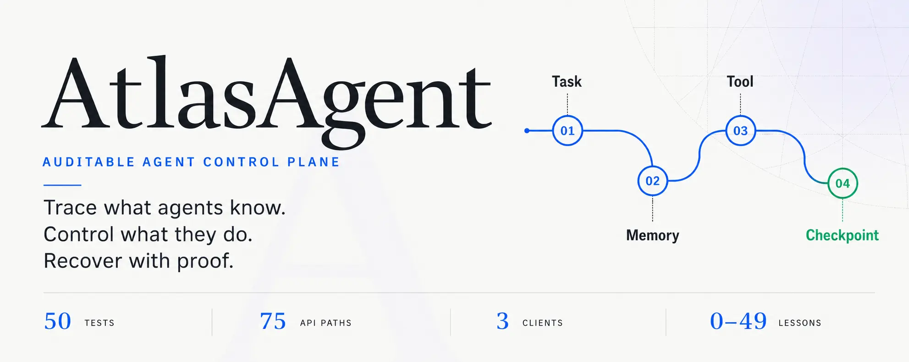
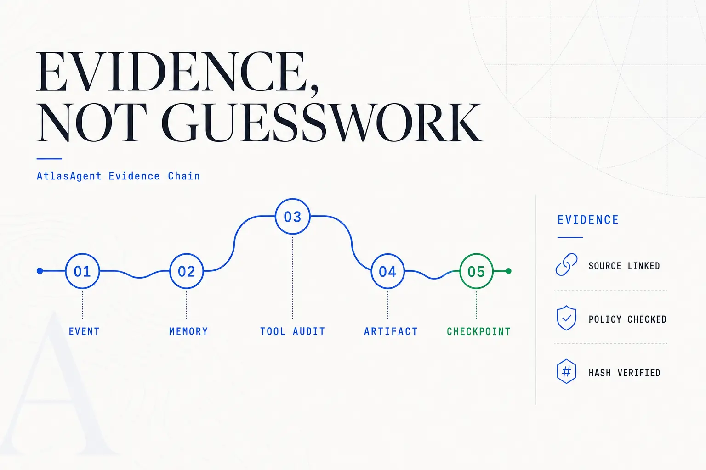
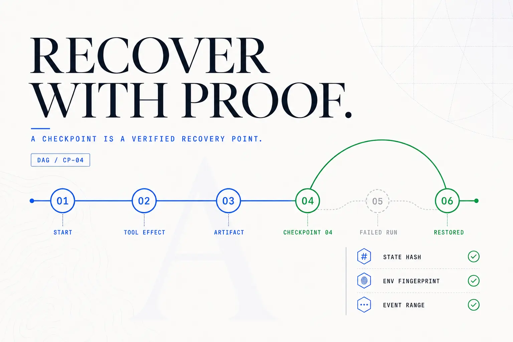
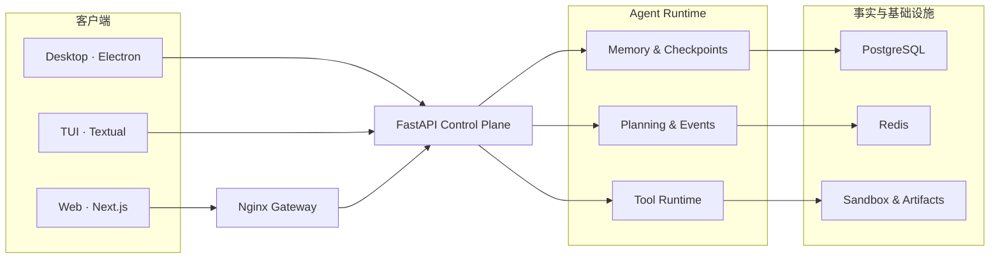
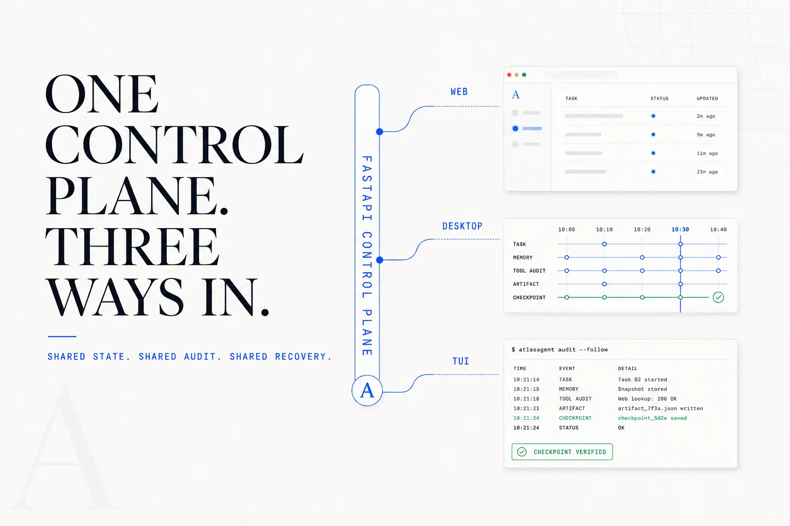

<p align="center">
  
</p>

<div align="center">

[快速开始](#快速开始) · [核心能力](#核心能力) · [运行机制](#运行机制) · [三个客户端](#三个客户端) · [完整教程](tutorial/README.md)

</div>

## 把 Agent 从会话应用升级为可控系统

AtlasAgent 是一套可运行的 AI Agent 控制平面与中文工程教程。它把原始事件、长期记忆、知识库检索、技能指引、工具调用、Artifact 和 Checkpoint 放进同一条可追溯链路，集中处理六个生产边界：**事实从哪里来、记忆为什么可信、资料引用能否追溯、工具何时允许执行、任务如何恢复，以及每一步如何审计。**

它不是只有一张聊天界面：同一套 FastAPI 控制平面同时服务 Next.js Web、Electron 时间线工作台与 Textual TUI，并配有从基础服务到 Memory / RAG / Skill / Tool Control Plane 的 **0–52 章教程**。

> [!NOTE]
> 当前版本先在教程第 0–44 章完成核心工作台，再由第 45–49 章收束 Control Plane、多客户端与交付验收，最后由第 50–52 章加上 RAG 知识库、Skill 注册中心与桌面管理工作台。既有 API 与 Web 工作流继续可用。

## 已验证的交付基线

| 范围 | 结果 | 验证内容 |
| --- | ---: | --- |
| FastAPI 后端 | **83 项测试** | 认证、队列恢复、Checkpoint、Tool Runtime、RAG 摄取与检索、Skill 生命周期、兼容接口与边界条件 |
| Sandbox | **1 项安全测试** | 健康端点公开、Shell 等状态接口必须认证 |
| Textual TUI | **3 项测试** | 启动、布局、审计视图与演示模式 |
| Electron 桌面端 | **构建 + 10 项测试** | 渲染器构建与类型检查、IPC 请求安全边界、打包适配 |
| OpenAPI | **91 条路径** | 应用完整加载并成功生成接口规范 |
| Alembic | **完整迁移链** | 可生成离线 SQL，Control Plane 与 RAG 表结构可追踪 |

测试数量是当前仓库的交付快照，不是性能基准。复现命令见 [开发与验证](#开发与验证)。

## 核心能力

<p align="center">
  
</p>

| 控制边界 | AtlasAgent 如何处理 | 关键机制 |
| --- | --- | --- |
| **Evidence-backed Memory** | 只把仍然有效、来源明确且通过门禁的事实注入上下文 | 类型化记忆、Write Gate、证据链、作用域、有效期、替代关系、可解释检索 |
| **RAG Knowledge Base** | 让团队文档成为可检索、可引用、可验证的证据来源 | 段落切分与重叠、可替换向量后端（pgvector / Qdrant）、向量+词法混合重排、编号引用、检索审计、多模态摄取（图片经视觉模型解析入库） |
| **Skill Registry** | 把团队沉淀的操作指引变成受治理、可回溯的 Agent 行为规范 | draft/published/deprecated 生命周期、published 内容冻结、semver 版本、启停分离、相关度注入 |
| **Checkpoint DAG** | 为长任务提供可验证的暂停、恢复与回溯点 | 父子 Checkpoint、事件区间、状态哈希、环境指纹、校验报告 |
| **Unified Tool Runtime** | 在 handler 之前统一约束权限与副作用 | 风险分级、审批、幂等、超时、脱敏、大输出制品化、全程审计 |
| **Artifact Store** | 让日志、补丁、截图和报告成为稳定事实源 | SHA-256 内容寻址、来源引用、任务与 Checkpoint 关联 |
| **Multi-client Workspace** | 在浏览器、桌面驻留和 SSH 场景中观察同一运行状态 | Next.js Web、Electron、Textual TUI，共用 FastAPI 接口 |
| **Isolated Sandbox** | 把文件、Shell 与浏览器自动化限制在独立运行边界 | 工作区限制、输出限制、VNC / noVNC、统一网关 |

## 运行机制

<p align="center">
  
</p>

控制面的事实优先级很明确：**原始事件与 Artifact 是事实源，任务状态是可重建的物化视图，Checkpoint 是经过验证的恢复点。**

一次任务会沿着这条链路推进：

1. 创建带目标和验收标准的结构化任务。
2. 从候选记忆中筛选有来源、未过期且相关的事实。
3. 工具进入统一 Runtime，先经过风险、权限和幂等检查，再执行 handler。
4. 大输出转为内容寻址 Artifact，调用过程写入审计记录。
5. 状态哈希、环境指纹和校验报告共同生成可恢复 Checkpoint。

<details>
<summary><strong>展开完整系统拓扑</strong></summary>

<br>



</details>

## 快速开始

需要 Git、Docker 与 Docker Compose v2。

```bash
git clone https://github.com/malevrigns/atlas-agent-control-plane.git
cd atlas-agent-control-plane
cp .env.example .env
BUILD=true ./scripts/start.sh
```

启动后访问：

- Web 工作台：<http://localhost:8088>
- API 健康检查：<http://localhost:8088/api/status>
- 数据库状态：<http://localhost:8088/api/status/database>

启动脚本会为 API 与 PostgreSQL 生成随机密钥，并在终端打印 Web 登录所需的 API Key。除 `/api/status` 外的接口都需要浏览器 HttpOnly 会话或 `X-Atlas-API-Key` 请求头。

Windows 请在 Git Bash 或已启用 Docker 集成的 WSL 中运行同一个安全启动脚本：

```bash
cp .env.example .env
BUILD=true ./scripts/start.sh
```

再次启动不需要重新构建：

```bash
./scripts/start.sh
```

停止服务：

```bash
./scripts/stop.sh
```

如需同时清理 PostgreSQL、Redis 与上传文件卷：

```bash
CLEAN_VOLUMES=true ./scripts/stop.sh
```

> [!TIP]
> 默认网关端口为 `8088`。端口冲突时设置 `NGINX_PORT=18088` 后重新启动。

## 三个客户端

<p align="center">
  
</p>

| 客户端 | 最适合 | 特色 |
| --- | --- | --- |
| **Web** | 浏览器协作与完整功能体验 | 会话、流式问答、文件、Sandbox、设置、MCP、A2A 与 Agent 工作流 |
| **Desktop** | 长时间驻留、治理与多面板观察 | 流式对话（默认视图）、Checkpoint 时间线、技能注册中心管理、知识库摄取与检索验证台、暂停/恢复、Ink / Dawn / Contrast 三主题 |
| **TUI** | SSH、低带宽与键盘工作流 | 任务 / Checkpoint / 审计三栏、快捷键、三套终端主题、离线演示数据 |

桌面端默认启用 `contextIsolation` 并关闭 `nodeIntegration`；主题选择会在本地持久化。TUI 的快捷键与客户端配置见 [客户端指南](docs/CLIENTS.md)。

## Control Plane 最小调用

### 1. 创建结构化任务

```bash
ATLAS_KEY="$(sed -n 's/^ATLAS_API_KEY=//p' .env)"
curl -X POST http://localhost:8088/api/control-plane/tasks \
  -H "X-Atlas-API-Key: ${ATLAS_KEY}" \
  -H "Content-Type: application/json" \
  -d '{
    "title": "更新交付物",
    "goal": "完成可验证升级",
    "acceptance_criteria": ["测试通过"],
    "project_id": "atlas"
  }'
```

### 2. 通过统一 Runtime 调用工具

```bash
curl -X POST http://localhost:8088/api/agent-core/tools/draft_plan/invoke \
  -H "X-Atlas-API-Key: ${ATLAS_KEY}" \
  -H "Content-Type: application/json" \
  -d '{
    "arguments": {"task": "检查交付质量"},
    "project_id": "atlas",
    "allowed_permissions": [],
    "idempotency_key": "demo-001"
  }'
```

### 3. 回读工具审计

```bash
curl -H "X-Atlas-API-Key: ${ATLAS_KEY}" \
  "http://localhost:8088/api/control-plane/tool-invocations?project_id=atlas"
```

### 4. 检索知识库并拿到带引用的证据

```bash
curl -X POST http://localhost:8088/api/rag/knowledge-bases/${KB_ID}/query \
  -H "X-Atlas-API-Key: ${ATLAS_KEY}" \
  -H "Content-Type: application/json" \
  -d '{"query": "数据库迁移怎么回滚", "top_k": 3}'
```

完整数据模型、生命周期和接口说明见 [Memory 与 Tool Control Plane](docs/MEMORY_TOOL_CONTROL_PLANE.md) 与 [RAG 与 Skill 注册中心](docs/RAG_AND_SKILLS.md)。

## 本地开发

先准备 PostgreSQL 与 Redis：

```bash
docker compose up -d postgres redis
```

| 模块 | 启动命令 | 默认地址 / 行为 |
| --- | --- | --- |
| API | `cd backend/api && uv sync && uv run uvicorn app.main:app --reload` | `http://localhost:8000` |
| Web | `cd frontend/web && pnpm install && pnpm dev` | `http://localhost:3000` |
| Desktop | `cd frontend/desktop && npm install && npm run electron:dev` | Electron 桌面窗口 |
| TUI | `cd frontend/tui && uv sync && ATLAS_API_URL=http://localhost:8000 uv run atlas-tui` | 后端不可达时自动进入演示模式 |
| Sandbox | `cd backend/sandbox && docker build -t atlas-sandbox . && docker run -d -p 8100:8100 -p 6080:6080 -e SANDBOX_AUTH_ENABLED=false atlas-sandbox` | Agent 的虚拟电脑：`http://localhost:8100`；API 侧设 `SANDBOX_API_BASE_URL=http://localhost:8100/api` 与 `TOOL_AUTO_APPROVE_RISK=high` 后，对话即可真实执行代码/浏览器任务 |

## 项目结构

```text
atlas-agent-control-plane/
├── frontend/
│   ├── web/       Next.js Web 客户端
│   ├── desktop/   Electron 桌面客户端
│   └── tui/       Textual 终端客户端
├── backend/
│   ├── api/       FastAPI、数据库迁移、Control Plane 与测试
│   └── sandbox/   文件、Shell、浏览器与 VNC 隔离执行环境
├── nginx/         统一网关配置
├── docs/          Control Plane 与客户端专题文档
├── tutorial/      0–52 章中文工程教程
├── scripts/       启停与运行时配置脚本
├── tests/         根级生产配置测试
└── docker-compose.yml
```

进一步阅读：

- [整体架构](ARCHITECTURE.md)
- [API 架构](backend/api/ARCHITECTURE.md)
- [API 依赖说明](backend/api/DEPENDENCIES.md)
- [Memory / Tool Control Plane](docs/MEMORY_TOOL_CONTROL_PLANE.md)
- [RAG 知识库与 Skill 注册中心](docs/RAG_AND_SKILLS.md)
- [Web、Desktop 与 TUI 客户端](docs/CLIENTS.md)
- [完整课程目录](tutorial/README.md)

## 开发与验证

```bash
# 后端测试
cd backend/api
uv run python -m unittest discover -s tests

# TUI 测试
cd ../../frontend/tui
uv run python -m unittest discover -s tests

# Desktop 构建、类型检查与测试
cd ../desktop
npm run build
npm test
```

## 配置与安全

服务端常用配置集中在根目录的 [`.env.example`](.env.example)：

- `LLM_API_KEY`：模型服务密钥；未配置时仍可使用不依赖模型的演示与控制平面能力。
  任何 OpenAI 兼容服务都可以接入：在 `backend/api/config/llm.yaml` 中把 `base_url`
  换成服务商地址（如 DeepSeek `https://api.deepseek.com/v1`、阿里云百炼
  `https://dashscope.aliyuncs.com/compatible-mode/v1`），`default_model` 换成对应模型名
  （如 `deepseek-chat`、`qwen-plus`），密钥只通过环境变量传入。
  会话消息默认直接由模型流式回答；命中搜索、网页、文件、命令等工具意图时才进入计划执行流水线。
  `llm.thinking: true`（llm.yaml）可开启思考过程流式输出（Qwen `enable_thinking`），
  Web 与桌面端会实时展示并支持事后展开回看；不支持的模型自动降级为普通流式回答。
  `llm.vision_model`（如 `qwen-vl-plus`）启用多模态 RAG：知识库页可上传截图/图表/扫描件，
  视觉模型提取文字与图表结构后切分入库，图中内容即可被检索与引用
- `ATLAS_API_KEY`：控制平面与 Sandbox 的共享访问密钥；启动脚本会替换示例占位符
- `NGINX_PORT`：统一网关端口，默认 `8088`
- `NGINX_HOST`：默认 `127.0.0.1`；确需远程访问时必须配合 TLS 与上游身份系统
- `TOOL_AUTO_APPROVE_RISK`：工具自动批准的最高风险等级
- `TOOL_DEFAULT_TIMEOUT_SECONDS`：工具默认超时
- `TOOL_OUTPUT_INLINE_LIMIT`：大输出转为 Artifact 的阈值
- `RAG_VECTOR_BACKEND`：RAG 向量后端，`pgvector`（默认）或 `qdrant`
- `RAG_EMBEDDING_PROVIDER`：`auto` 按 `llm.yaml` 与密钥自动选择，`local_hash` 强制离线哈希向量
- `EMBEDDING_API_KEY`：OpenAI 兼容 embedding 服务密钥；留空时自动降级为本地向量

客户端地址分别通过 `ATLAS_API_BASE_URL`（Electron）和 `ATLAS_API_URL`（TUI）设置；两者都从 `ATLAS_API_KEY` 读取凭据。

> [!IMPORTANT]
> 不要提交真实 `.env`、模型密钥或第三方服务凭据。stdio MCP、MCP HTTP 与 A2A HTTP 默认关闭或无允许主机，必须由运维通过 allowlist 显式放行。内置 API Key 是单租户/内网边界，互联网多用户部署仍应在网关前接入 TLS、OIDC/RBAC 与限流。

## 教程路线

教程从最小可运行服务逐步演进到完整控制平面：

1. FastAPI、Next.js、PostgreSQL 与 Redis 基础
2. 会话、流式消息、文件与上下文工程
3. Agent 规划执行、工具、MCP、A2A 与多 Agent 协作
4. Sandbox、浏览器自动化、可观测性、安全与 Harness
5. 类型化 Memory、Checkpoint DAG、Tool Runtime、Electron 与 TUI
6. RAG 知识库、Skill 注册中心与桌面管理工作台

从 [教程首页](tutorial/README.md) 开始，或直接阅读 [Control Plane 升级说明](docs/MEMORY_TOOL_CONTROL_PLANE.md)。

---

<div align="center">

**AtlasAgent · Build agents that can explain what they know, what they did, and how to recover.**

</div>
