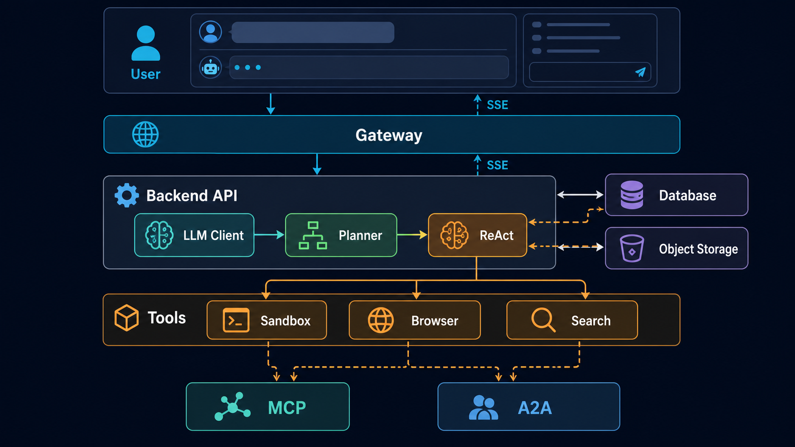

# AtlasAgent · 智能体开发实战教程

## 写在前面
​        项目的开始源于工作和学习的需要。有时候我在想，当今世界从 OpenClaw、Hermes、Claude Code、Codex 等 Agent 横空出世之后，强工具调用的 Agent 已经展现出极其强大的通用能力。它们会读代码，会调用命令，会搜索资料，会写页面，也会在某种程度上替人拆解问题。似乎人类在通往 AGI 的道路上确实迈出了一大步。
​        笔者第一次部署 OpenClaw 时，它带给我的体验是前所未有的。但问题也随之而来：这些通用 Agent 已经这么强大了，我们还有没有必要从零开发一个新的智能体？这个问题困扰了笔者很久。后来笔者慢慢有了答案：做自己领域的垂类 Agent，和使用通用 Agent，并不冲突。通用 Agent 像一把通用刀，而垂类 Agent 更像一台已经按业务流程装配好的机器。前者解决广泛问题，后者解决稳定场景。
​        也正因如此，才有了这次实践记录。笔者很少写文档，不过这次还是想把开发过程中的问题、架构取舍和一些不成熟的技术思考记录下来。纵使这个时代资料多如繁星，我也希望自己的思考能在这个时代留下痕迹。
​        项目开始之前，笔者先简要说一下技术栈。笔者素来推崇前沿技术，当然这多少有点激进，因为前沿技术在生态完备性和工程成熟度上总会有所欠缺。笔者喜欢 Rust 给人的安全感，也喜欢 Go 天然高并发的通畅。可惜这次实践并不以炫技为目的，而是要把一个完整的 AI Agent 工作台从零搭出来，所以笔者会更看重工程闭环：后端、前端、数据库、消息流、沙箱、工具、部署，都要能跑起来。
​        本项目可以概括为一个全栈 AI Agent 工作台。它不是一个只接 LLM 接口的聊天壳，也不是一个提示词页面，而是一个能围绕任务进行规划、执行、调用工具、观察结果、形成最终回答的系统。它包含 FastAPI、SQLAlchemy、Alembic、PostgreSQL、Redis、Next.js、Electron、Textual、Nginx、Docker Compose、Sandbox、Playwright、VNC、MCP、A2A、多 Agent 编排、类型化长期记忆、Checkpoint DAG 以及可审计 Tool Runtime。
​        言归正传，下面进入真正的项目初始化。本文后续统一把项目称为 AtlasAgent，名字不重要，重要的是我们要亲手把它从一堆目录变成一个能执行任务的 Agent 产品。


## 如何使用本教程

​        本教程共 50 章（第 0 章到第四十九章），建议按顺序阅读。每一章的结构基本一致：

- **本章目标**：读完这一章你能做到什么。
- **为什么需要这一章**：设计动机、架构取舍与常见坑。
- **实现步骤**：分步给出后端 / 前端 / 配置的完整可运行代码。
- **本章小结 / 验收**：如何确认这一章确实跑通。

​        只要跟着 50 章走完，你就能从一个空目录，亲手搭出一个能规划任务、调用工具、观察结果并生成带证据最终回答的全栈 AI Agent 工作台，并学会把它升级为有认证、可恢复、可追溯、可审计的 Control Plane。

### 配套源码

​        教程中的实现阶段都对应一份可运行的源码快照，位于同级的配套源码仓库 `atlas-agents-source/`：

```text
atlas-agent/
├── atlas-agent-tutorial/                     # 本教程
├── atlas-agents-source/
│   └── chapters/
│       ├── atlas-agents-01/                  # 开发里程碑 01
│       ├── atlas-agents-02/                  # 开发里程碑 02
│       ├── ...
│       └── atlas-agents-67/                  # 开发里程碑 67（最终完整项目）
└── atlas-agent-standalone/                   # 去课程化的独立产品发行物
```

​        快照是“累积式”的，但编号沿用项目最初的 67 个开发里程碑，不再与合并后的 50 章一一对应。合并章会在正文中标明先后阶段，可能连续使用两个里程碑快照。推荐的学习方式：

1. 先读本章正文，理解“要做什么、为什么这么做”；
2. 跟着代码自己敲一遍；
3. 卡住时，对照正文标注的 `atlas-agents-NN` 里程碑快照检查差异。

### 技术栈

| 层 | 技术 |
| --- | --- |
| 后端 API | FastAPI · SQLAlchemy · Alembic · PostgreSQL · Redis |
| 客户端 | Next.js Web · Electron 桌面端 · Textual TUI |
| 沙箱 | FastAPI · Playwright · Xvfb + noVNC 远程桌面 |
| Agent 能力 | 规划 / ReAct · 类型化记忆 · Checkpoint DAG · 可审计 Tool Runtime · MCP / A2A |
| 部署 | Nginx 网关 · Docker Compose · 私有化交付 |

### 环境准备

- Docker 与 Docker Compose（一键起全套基础设施）
- Node.js 20+ 与 pnpm（前端）
- Python 3.11+ 与 uv（后端 / 沙箱）
- 一个 OpenAI 兼容的大模型 API Key（默认接入 DeepSeek，可在 `api/config/llm.yaml` 中改成任意 OpenAI 兼容服务）

### 快速跑通最终项目

```bash
cd ../atlas-agents-source/chapters/atlas-agents-67
cp .env.example .env          # 在 .env 里填入 LLM_API_KEY
BUILD=true ./scripts/start.sh # 首次构建并启动 nginx / ui / api / sandbox / postgres / redis
# 之后再启动只需 ./scripts/start.sh
```

> 网关默认只绑定 `127.0.0.1`。启动脚本会生成 API Key；打开 Web 后输入终端打印的 Key，脚本不会把密钥写入浏览器存储。

​        启动后统一入口在 `http://localhost:8088`，可以先做几个健康检查：

```bash
curl http://localhost:8088/api/status
ATLAS_KEY="$(sed -n 's/^ATLAS_API_KEY=//p' .env)"
curl -H "X-Atlas-API-Key: ${ATLAS_KEY}" http://localhost:8088/api/status/database
```

​        停止服务：

```bash
./scripts/stop.sh                    # 保留数据卷
CLEAN_VOLUMES=true ./scripts/stop.sh # 连同数据库、Redis、上传文件一起清理
```


## 目录

- [第 0 章. 项目缘起](chapters/00-项目缘起.md)
- [第一章. 项目伊始](chapters/01-项目伊始.md)
- [第二章. Docker Compose 基础设施奠基](chapters/02-Docker%20Compose%20基础设施奠基.md)
- [第三章. 后端 API 与通用模块奠基](chapters/03-后端%20API%20与通用模块奠基.md)
- [第四章. 前端 UI 与 Nginx 网关贯通](chapters/04-前端%20UI%20与%20Nginx%20网关贯通.md)
- [第五章. 数据库、迁移与会话模型立制](chapters/05-数据库、迁移与会话模型立制.md)
- [第六章. 会话开立与左侧列表](chapters/06-会话开立与左侧列表.md)
- [第七章. 对话消息与 SSE 事件流](chapters/07-对话消息与%20SSE%20事件流.md)
- [第八章. 会话状态与任务收放](chapters/08-会话状态与任务收放.md)
- [第九章. 文件上传、存储与预览](chapters/09-文件上传、存储与预览.md)
- [第十章. 文件存储拓界](chapters/10-文件存储拓界.md)
- [第十一章. 应用配置与 LLM 客户端就位](chapters/11-应用配置与%20LLM%20客户端就位.md)
- [第十二章. Agent 思维、Memory 与工具协议](chapters/12-Agent%20思维、Memory%20与工具协议.md)
- [第十三章. PlannerAgent 与 ReActAgent 执行闭环](chapters/13-PlannerAgent%20与%20ReActAgent%20执行闭环.md)
- [第十四章. AgentTaskRunner 与 Redis Stream 任务流转](chapters/14-AgentTaskRunner%20与%20Redis%20Stream%20任务流转.md)
- [第十五章. 上下文工程](chapters/15-上下文工程.md)
- [第十六章. Sandbox 服务与文件工具](chapters/16-Sandbox%20服务与文件工具.md)
- [第十七章. Sandbox Shell 与 Docker 隔离](chapters/17-Sandbox%20Shell%20与%20Docker%20隔离.md)
- [第十八章. Playwright、CDP 与 BrowserTool](chapters/18-Playwright、CDP%20与%20BrowserTool.md)
- [第十九章. VNC 远程桌面与工具预览](chapters/19-VNC%20远程桌面与工具预览.md)
- [第二十章. SearchTool 搜索能力成形](chapters/20-SearchTool%20搜索能力成形.md)
- [第二十一章. MCP 协议与工具接入](chapters/21-MCP%20协议与工具接入.md)
- [第二十二章. 后端分层框架再造](chapters/22-后端分层框架再造.md)
- [第二十三章. A2A 协议与工具接入](chapters/23-A2A%20协议与工具接入.md)
- [第二十四章. 多 Agent 协作统筹](chapters/24-多%20Agent%20协作统筹.md)
- [第二十五章. 设置面板落成](chapters/25-设置面板落成.md)
- [第二十六章. AI 对话工作台与执行详情](chapters/26-AI%20对话工作台与执行详情.md)
- [第二十七章. 长期记忆与上下文注入](chapters/27-长期记忆与上下文注入.md)
- [第二十八章. Agent Runner 与模型工具选择](chapters/28-Agent%20Runner%20与模型工具选择.md)
- [第二十九章. 复杂任务复原与 Agent Harness](chapters/29-复杂任务复原与%20Agent%20Harness.md)
- [第三十章. 生产构建、测试与可观测性](chapters/30-生产构建、测试与可观测性.md)
- [第三十一章. 安全加固与沙箱划界](chapters/31-安全加固与沙箱划界.md)
- [第三十二章. 产品体验验收与前端交互细琢](chapters/32-产品体验验收与前端交互细琢.md)
- [第三十三章. 组件规范与流式执行体验](chapters/33-组件规范与流式执行体验.md)
- [第三十四章. 工具工作区、响应式与可访问性](chapters/34-工具工作区、响应式与可访问性.md)
- [第三十五章. 对话叙事、Markdown 与计划动效](chapters/35-对话叙事、Markdown%20与计划动效.md)
- [第三十六章. 工具详情、浏览器观察与搜索稳定性](chapters/36-工具详情、浏览器观察与搜索稳定性.md)
- [第三十七章. 任务自动执行与步骤卡片](chapters/37-任务自动执行与步骤卡片.md)
- [第三十八章. 详情抽屉、配置中心与集成验收](chapters/38-详情抽屉、配置中心与集成验收.md)
- [第三十九章. 后端异常与任务错误体验](chapters/39-后端异常与任务错误体验.md)
- [第四十章. 文件解析、摘要、引用与预览](chapters/40-文件解析、摘要、引用与预览.md)
- [第四十一章. 最终回答质量与引用体系](chapters/41-最终回答质量与引用体系.md)
- [第四十二章. 最终 UI 微调与交付清单](chapters/42-最终%20UI%20微调与交付清单.md)
- [第四十三章. Docker 私有化部署与内网交付](chapters/43-Docker%20私有化部署与内网交付.md)
- [第四十四章. 项目简历落笔](chapters/44-项目简历落笔.md)
- [第四十五章. Memory Control Plane 与 Checkpoint DAG](chapters/45-Memory%20Control%20Plane%20与%20Checkpoint%20DAG.md)
- [第四十六章. Tool Runtime 权限、幂等与审计](chapters/46-Tool%20Runtime%20权限、幂等与审计.md)
- [第四十七章. Electron 多主题桌面客户端](chapters/47-Electron%20多主题桌面客户端.md)
- [第四十八章. 键盘优先 TUI 客户端](chapters/48-键盘优先%20TUI%20客户端.md)
- [第四十九章. 迁移、测试与交付验收](chapters/49-迁移、测试与交付验收.md)
