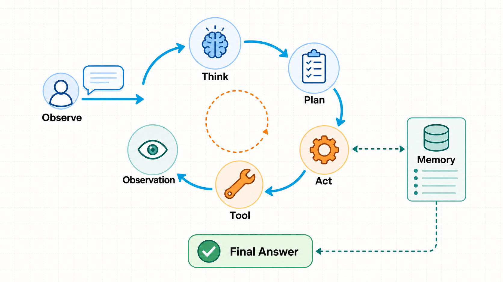

# 第十三章. PlannerAgent 与 ReActAgent 执行闭环

## 13.1 合章说明

​        旧版教程把“PlannerAgent 任务运筹”与“ReActAgent 循步而行”拆成了相邻两章。两者实际上属于同一条能力链：前者把基础结构立住，后者让它进入可用状态。本章将它们合并为前后两个阶段，保留原来的实现、验证与工程判断，同时减少能力尚未闭环时的章节跳转。

## 13.2 第一阶段：PlannerAgent 任务运筹

### 13.2.1 本阶段目标
​        第 12 章已经让系统具备了 Memory 和工具协议，但 Agent 要真正执行一个复杂任务，还需要先知道“要按什么顺序做”。这正是 PlannerAgent 的位置：它不负责直接完成用户任务，而是把用户输入转换成结构化计划，让后续执行器有明确的目标、步骤和预期输出。
​        本阶段会把 PlannerAgent 接入真实会话。后端会新增计划步骤领域模型和 `PlannerService`，优先使用 LLM 生成 JSON 计划，解析失败或模型不可用时生成稳定的教学 fallback，再把计划保存成 `plan_created` 会话事件。前端会在聊天工作台右侧加入计划面板，并从事件列表中恢复最新计划。这样计划不再是临时页面状态，而是会话时间线里真实发生过的一次 Agent 动作。

### 13.2.2 最终效果
​        本阶段结束后，后端新增接口：

```Plain
POST /api/sessions/{session_id}/plan
```

​        前端聊天工作台右侧会新增“计划面板”。
​        使用流程：

```Plain
创建会话
  |
  v
输入任务
  |
  v
点击计划面板里的“生成”
  |
  v
后端生成 plan_created 事件
  |
  v
前端展示计划步骤
```

​        本阶段只生成计划，不执行计划。本章第二阶段会实现 ReActAgent，让计划步骤逐步执行并流式展示工具调用。

### 13.2.3 本阶段要解决的问题
​        第 12 章已经有了 Memory 和工具协议，但还没有真正的任务规划能力。
​        如果用户输入：

```Plain
帮我从 0 到 1 实现一个 AI Agent 项目
```

​        普通 ChatBot 可能直接给一段回答。
​        PlannerAgent 要做的是把这个任务变成结构化计划：

```Plain
目标：实现一个可运行的 AI Agent 项目

步骤：
1. 明确需求和边界
2. 设计后端接口和数据模型
3. 设计前端交互
4. 接入工具和执行流程
5. 验证和总结
```

​        这样后续 ReActAgent 才能逐步执行，而不是在一条消息里把所有事情说完。

### 13.2.4 本阶段技术方案
​        本阶段后端调用链路：

```Plain
POST /api/sessions/{session_id}/plan
  |
  v
PlannerService.create_plan()
  |
  +-- 检查会话是否存在
  +-- 调用 LLMService.chat()
  +-- 解析 JSON 计划
  +-- 写入 session_events.plan_created
  +-- 更新会话 updated_at
```

​        前端调用链路：

```Plain
PlanPanel
  |
  v
session-store.createPlan()
  |
  v
session-api.createPlan()
  |
  v
/api/sessions/{session_id}/plan
  |
  v
把 plan_created 事件追加到当前事件列表
```

​        为什么计划保存成事件，而不是新建计划表？
​        当前阶段更重要的是让会话时间线能看到 Agent 做了什么。计划生成本身就是会话中的一个重要动作，适合先进入 `session_events`。
​        后续如果计划需要编辑、版本管理、多人协作，再单独拆出 `plans` 表也不晚。

### 13.2.5 新增和修改的文件

```Plain
README.md
api/README.md
api/app/api/routes/sessions.py
api/app/application/planner_service.py
api/app/domain/agent_core/planner.py
api/app/domain/sessions/entities.py
api/app/schemas/session.py
docs/course/chapters/18-planner-agent.md
ui/README.md
ui/app/components/chat-workspace.tsx
ui/app/components/plan-panel.tsx
ui/app/lib/session-api.ts
ui/app/page.tsx
ui/app/stores/session-store.ts
ui/app/types.ts
```

### 13.2.6 实施步骤
#### 13.2.6.1 扩展会话事件类型
​        打开 `api/app/domain/sessions/entities.py`，扩展 `SessionEventType`：

```Python
class SessionEventType(StrEnum):
    message_created = "message_created"
    plan_created = "plan_created"
```

##### 13.2.6.1.1 代码讲解
​        第 7 章只有 `message_created`，表示用户消息被创建。
​        本阶段新增 `plan_created`，表示 PlannerAgent 为当前会话生成了一份计划。
​        事件表已经有：

```Plain
type
payload
created_at
```

​        所以不需要新增迁移文件。计划会保存在 `payload` 里。

#### 13.2.6.2 定义计划领域模型
​        创建 `api/app/domain/agent_core/planner.py`：

```Python
from dataclasses import dataclass
from enum import StrEnum
from uuid import UUID, uuid4

# ===================== 第1步：定义计划步骤状态 =====================
class PlanStepStatus(StrEnum):
    """计划步骤的执行状态。

    第 18 章只生成计划，不执行步骤，所以默认都是 pending。
    """

    pending = "pending"
    running = "running"
    completed = "completed"
    failed = "failed"

# ===================== 第2步：定义一个计划步骤 =====================
@dataclass(slots=True)
class PlanStep:
    """PlannerAgent 生成的单个任务步骤。"""

    id: UUID
    title: str
    description: str
    expected_output: str
    status: PlanStepStatus = PlanStepStatus.pending

# ===================== 第3步：定义完整计划 =====================
@dataclass(slots=True)
class AgentPlan:
    """PlannerAgent 对用户任务生成的完整计划。"""

    id: UUID
    title: str
    goal: str
    steps: list[PlanStep]
    source: str

# ===================== 第4步：提供便捷创建函数 =====================
def create_agent_plan(
    title: str,
    goal: str,
    steps: list[PlanStep],
    source: str,
) -> AgentPlan:
    """统一创建计划对象，避免应用层手动生成 plan id。"""

    return AgentPlan(
        id=uuid4(),
        title=title,
        goal=goal,
        steps=steps,
        source=source,
    )

def create_plan_step(
    title: str,
    description: str,
    expected_output: str,
) -> PlanStep:
    """统一创建计划步骤，默认状态为 pending。"""

    return PlanStep(
        id=uuid4(),
        title=title,
        description=description,
        expected_output=expected_output,
    )
```

##### 13.2.6.2.1 代码讲解
​        `PlanStepStatus` 先定义四种状态：

```Plain
pending
running
completed
failed
```

​        本阶段只生成计划，所以步骤默认是 `pending`。本章第二阶段执行步骤时，才会让状态进入 `running`、`completed` 或 `failed`。
​        `AgentPlan.source` 用来记录计划来源：

```Plain
llm       来自真实模型
fallback  来自教学 fallback
```

​        这样前端和调试日志可以知道这份计划是不是模型生成的。

#### 13.2.6.3 编写 PlannerService
​        创建 `api/app/application/planner_service.py`。
​        核心代码如下：

```Python
import json
from uuid import UUID

from app.application.llm_service import LLMService
from app.application.unit_of_work import UnitOfWork
from app.core.exceptions import AppException
from app.domain.agent_core.planner import (
    AgentPlan,
    PlanStep,
    create_agent_plan,
    create_plan_step,
)
from app.domain.llm.entities import LLMMessage
from app.domain.sessions.entities import SessionEvent, SessionEventType

class PlannerService:
    """第 18 章的 PlannerAgent 应用服务。

    它负责把用户任务转换成结构化计划，并把计划保存成 session event。
    """

    def __init__(
        self,
        uow: UnitOfWork,
        llm_service: LLMService | None = None,
    ) -> None:
        # ===================== 第1步：保存依赖 =====================
        self.uow = uow
        self.llm_service = llm_service or LLMService()

    # ===================== 第2步：生成计划并写入会话事件 =====================
    async def create_plan(
        self,
        session_id: UUID,
        task: str,
    ) -> tuple[AgentPlan, SessionEvent]:
        """为会话生成计划，并保存 plan_created 事件。"""

        clean_task = task.strip()
        if not clean_task:
            raise AppException(
                message="task is required",
                code=400,
                status_code=400,
            )

        session = await self.uow.sessions.get(session_id)
        if session is None:
            raise AppException(
                message="session not found",
                code=404,
                status_code=404,
            )

        plan = await self._generate_plan(clean_task)
        event = await self.uow.session_events.add(
            session_id=session_id,
            event_type=SessionEventType.plan_created,
            payload=self._plan_to_payload(plan),
        )
        await self.uow.sessions.touch(session_id)
        await self.uow.commit()
        return plan, event
```

##### 13.2.6.3.1 代码讲解
​        `create_plan()` 的业务流程是：

```Plain
清理 task
  |
  v
检查会话是否存在
  |
  v
生成 AgentPlan
  |
  v
写入 plan_created 事件
  |
  v
更新会话 updated_at
  |
  v
提交事务
```

​        生成计划和保存事件放在同一个应用服务里，是因为它们属于同一个业务动作。

#### 13.2.6.4 调用 LLM 并解析计划
​        继续在 `planner_service.py` 中编写：

```Python
    # ===================== 第3步：优先使用 LLM 生成计划 =====================
    async def _generate_plan(self, task: str) -> AgentPlan:
        """调用 LLM 生成结构化计划；不可用时返回教学 fallback。"""

        try:
            result = await self.llm_service.chat(
                messages=[
                    LLMMessage(
                        role="system",
                        content=(
                            "你是一个 PlannerAgent。请把用户任务拆成 3 到 5 个可执行步骤。"
                            "只返回 JSON，不要返回 Markdown。JSON 格式为："
                            '{"title":"计划标题","goal":"目标","steps":['
                            '{"title":"步骤标题","description":"步骤说明","expected_output":"预期输出"}'
                            "]}"
                        ),
                    ),
                    LLMMessage(role="user", content=task),
                ],
                temperature=0.2,
                max_tokens=1200,
            )
            return self._parse_llm_plan(task=task, content=result.content)
        except AppException:
            # 没配置 API Key 或 provider 出错时，仍然给出可运行的教学计划。
            # 这样第 18 章不会因为外部服务不可用而无法验证主流程。
            return self._build_fallback_plan(task)
```

##### 13.2.6.4.1 代码讲解
​        这里要求模型只返回 JSON。
​        原因是后端要把计划保存成结构化数据。如果模型返回一大段 Markdown，前端很难稳定解析步骤。
​        这里捕获 `AppException` 后返回 fallback 计划。这样即使本机没有配置 `LLM_API_KEY`，也能跑通：

```Plain
接口
事件保存
前端计划面板
```

​        如果你已经配置了 DeepSeek 或其他 OpenAI 兼容模型，`source` 会更可能是 `llm`；如果模型不可用，`source` 会是 `fallback`。

#### 13.2.6.5 解析 JSON 和保存事件 payload
​        继续在 `planner_service.py` 中编写：

```Python
    # ===================== 第4步：解析 LLM 返回的 JSON 计划 =====================
    def _parse_llm_plan(self, task: str, content: str) -> AgentPlan:
        """把模型返回文本解析成 AgentPlan。"""

        try:
            data = json.loads(self._strip_code_fence(content))
        except json.JSONDecodeError:
            return self._build_fallback_plan(task)

        steps = [
            create_plan_step(
                title=str(item.get("title", "")).strip() or "未命名步骤",
                description=str(item.get("description", "")).strip() or "补充步骤说明",
                expected_output=str(item.get("expected_output", "")).strip()
                or "完成该步骤的可检查结果",
            )
            for item in data.get("steps", [])
            if isinstance(item, dict)
        ]
        if not steps:
            return self._build_fallback_plan(task)

        return create_agent_plan(
            title=str(data.get("title", "")).strip() or "任务执行计划",
            goal=str(data.get("goal", "")).strip() or task,
            steps=steps[:5],
            source="llm",
        )

    # ===================== 第5步：处理模型可能返回的代码块包裹 =====================
    def _strip_code_fence(self, content: str) -> str:
        """去掉 ```json ... ``` 这类包裹，提升 JSON 解析成功率。"""

        clean_content = content.strip()
        if clean_content.startswith("```"):
            lines = clean_content.splitlines()
            if lines and lines[0].startswith("```"):
                lines = lines[1:]
            if lines and lines[-1].startswith("```"):
                lines = lines[:-1]
            return "\n".join(lines).strip()
        return clean_content

    # ===================== 第7步：把 AgentPlan 转成事件 payload =====================
    def _plan_to_payload(self, plan: AgentPlan) -> dict:
        """把计划对象转换成可以存入 JSONB 的字典。"""

        return {
            "id": str(plan.id),
            "plan_id": str(plan.id),
            "title": plan.title,
            "goal": plan.goal,
            "source": plan.source,
            "steps": [
                {
                    "id": str(step.id),
                    "title": step.title,
                    "description": step.description,
                    "expected_output": step.expected_output,
                    "status": step.status.value,
                }
                for step in plan.steps
            ],
        }
```

##### 13.2.6.5.1 代码讲解
​        模型有时会返回带代码块包裹的内容：

~~~Plain
```json
{ ... }
```
~~~

​        所以 `_strip_code_fence()` 会先去掉外层包裹，再把内部字符串交给 `json.loads()`。`_parse_llm_plan()` 也不是直接相信模型输出，而是先处理 JSON 解析失败，再处理没有 `steps` 的情况，最后给单个空字段补默认值。这样即使模型返回格式不够稳定，接口也不会把半成品结构直接交给前端。
​        `_plan_to_payload()` 负责把 `AgentPlan` 转成 JSONB 可保存的字典。这里同时保存 `id` 和 `plan_id`：`id` 方便前端按统一计划类型读取，`plan_id` 则保留事件语义，明确这个字段表示计划 ID。

#### 13.2.6.6 扩展会话 Schema
​        打开 `api/app/schemas/session.py`，新增：

```Python
class PlanCreateRequest(BaseModel):
    task: str = Field(min_length=1, max_length=4000)
```

​        继续新增响应结构：

```Python
class PlanStepResponse(BaseModel):
    id: UUID
    title: str
    description: str
    expected_output: str
    status: str

class PlanResponse(BaseModel):
    id: UUID
    title: str
    goal: str
    source: str
    steps: list[PlanStepResponse]

class PlanCreateResponse(BaseModel):
    plan: PlanResponse
    event: SessionEventResponse
```

##### 13.2.6.6.1 代码讲解
​        `PlanCreateResponse` 同时返回：

```Plain
plan   方便前端立即展示
event  方便前端追加到事件列表
```

​        这样前端不需要生成计划后再额外请求一次事件列表。

#### 13.2.6.7 新增会话计划接口
​        打开 `api/app/api/routes/sessions.py`。
​        新增依赖：

```Python
def build_planner_service(
    db_session: AsyncSession = Depends(get_db_session),
) -> PlannerService:
    return PlannerService(UnitOfWork(db_session), LLMService())
```

​        新增转换函数：

```Python
def to_plan_response(plan: AgentPlan) -> PlanResponse:
    return PlanResponse(
        id=plan.id,
        title=plan.title,
        goal=plan.goal,
        source=plan.source,
        steps=[
            PlanStepResponse(
                id=step.id,
                title=step.title,
                description=step.description,
                expected_output=step.expected_output,
                status=step.status.value,
            )
            for step in plan.steps
        ],
    )
```

​        新增接口：

```Python
@router.post(
    "/{session_id}/plan",
    response_model=ApiResponse[PlanCreateResponse],
)
async def create_plan(
    session_id: UUID,
    payload: PlanCreateRequest,
    service: PlannerService = Depends(build_planner_service),
) -> ApiResponse[PlanCreateResponse]:
    plan, event = await service.create_plan(
        session_id=session_id,
        task=payload.task,
    )
    return ApiResponse(
        data=PlanCreateResponse(
            plan=to_plan_response(plan),
            event=to_event_response(event),
        )
    )
```

##### 13.2.6.7.1 代码讲解
​        接口路径放在会话下面：

```Plain
/api/sessions/{session_id}/plan
```

​        原因是计划不是孤立存在的，它属于某一个会话。
​        这个接口后续会成为真实 Agent 流程的一部分：

```Plain
用户消息
  |
  v
生成计划
  |
  v
执行计划
  |
  v
产生工具事件和最终回答
```

#### 13.2.6.8 扩展前端类型和 API
​        打开 `ui/app/types.ts`，新增：

```TypeScript
export type PlanStep = {
  id: string;
  title: string;
  description: string;
  expected_output: string;
  status: string;
};

export type AgentPlan = {
  id: string;
  title: string;
  goal: string;
  source: string;
  steps: PlanStep[];
};

export type PlanCreateData = {
  plan: AgentPlan;
  event: SessionEventItem;
};
```

​        打开 `ui/app/lib/session-api.ts`，新增：

```TypeScript
export function createPlan(
  sessionId: string,
  task: string,
): Promise<PlanCreateData> {
  return requestApi<PlanCreateData>(`/api/sessions/${sessionId}/plan`, {
    method: "POST",
    body: JSON.stringify({ task }),
  });
}
```

##### 13.2.6.8.1 代码讲解
​        前端的 `AgentPlan` 对齐后端 `PlanResponse`。
​        `createPlan()` 只负责发送请求，不处理页面状态。页面状态仍然放在 zustand store 中。

#### 13.2.6.9 在 session-store 中加入计划状态
​        打开 `ui/app/stores/session-store.ts`，新增状态：

```TypeScript
latestPlan: AgentPlan | null;
planning: boolean;
```

​        新增 action：

```TypeScript
createPlan: async () => {
  const sessionId = get().selectedSessionId;
  if (!sessionId) {
    set({ actionError: "请先选择一个会话" });
    return;
  }

  const messageState = get().messages;
  const currentMessages =
    messageState.type === "ready" ? messageState.data : [];
  const latestUserMessage = [...currentMessages]
    .reverse()
    .find((message) => message.role === "user");
  const task = get().draft.trim() || latestUserMessage?.content.trim() || "";
  if (!task) {
    set({ actionError: "请输入任务，或先发送一条用户消息" });
    return;
  }

  set({ actionError: null, planning: true });
  try {
    const result = await createPlan(sessionId, task);
    set((state) => {
      const currentEvents =
        state.events.type === "ready" ? state.events.data : [];
      const events = [...currentEvents, result.event];
      return {
        events: { type: "ready", data: events },
        latestPlan: result.plan,
      };
    });
    await get().refreshSessions();
  } catch (error) {
    set({ actionError: getErrorMessage(error) });
  } finally {
    set({ planning: false });
  }
}
```

##### 13.2.6.9.1 代码讲解
​        生成计划时，任务来源有两个优先级：

```Plain
1. 当前输入框内容
2. 最近一条用户消息
```

​        这样用户有两种自然用法：可以先在输入框里写任务，直接点击计划面板生成计划；也可以先把任务作为消息发送出去，再让 PlannerAgent 根据最近一条用户消息生成计划。前者更像“先规划再发送”，后者更像“围绕已有会话继续规划”，两种路径最终都会落到同一个 `createPlan()` 动作。
​        生成成功后，前端会做两件事：

```Plain
把 plan_created 事件追加到 events
把 result.plan 保存为 latestPlan
```

#### 13.2.6.10 从事件恢复最新计划
​        继续在 `session-store.ts` 中新增：

```TypeScript
function toPlan(event: SessionEventItem): AgentPlan | null {
  if (event.type !== "plan_created") {
    return null;
  }
  const payload = event.payload as Partial<AgentPlan>;
  if (
    !payload.id ||
    !payload.title ||
    !payload.goal ||
    !payload.source ||
    !Array.isArray(payload.steps)
  ) {
    return null;
  }
  return {
    id: String(payload.id),
    title: String(payload.title),
    goal: String(payload.goal),
    source: String(payload.source),
    steps: payload.steps,
  };
}

function getLatestPlan(events: SessionEventItem[]) {
  return [...events]
    .reverse()
    .map(toPlan)
    .find((plan): plan is AgentPlan => plan !== null) ?? null;
}
```

##### 13.2.6.10.1 代码讲解
​        这段代码解决的是“刷新页面后计划还在不在”的问题。
​        计划已经保存成事件，所以重新加载会话详情时，可以从事件列表中找到最后一个 `plan_created`：

```Plain
events
  |
  v
倒序查找 plan_created
  |
  v
恢复 latestPlan
```

​        这样计划面板不是临时 UI 状态，而是来自后端持久化事件。

#### 13.2.6.11 创建计划面板组件
​        创建 `ui/app/components/plan-panel.tsx`：

```TypeScript
import { GitBranch, Loader2, Sparkles } from "lucide-react";

import type { AgentPlan } from "../types";

type PlanPanelProps = {
  disabled: boolean;
  onCreatePlan: () => void;
  plan: AgentPlan | null;
  planning: boolean;
};

// ===================== 第1步：展示当前会话的最新计划 =====================
export function PlanPanel({
  disabled,
  onCreatePlan,
  plan,
  planning,
}: PlanPanelProps) {
  return (
    <div className="rounded-md border border-slate-200 bg-white p-5">
      <div className="flex items-start justify-between gap-3">
        <div>
          <h2 className="text-base font-semibold text-slate-950">计划面板</h2>
          <p className="mt-1 text-sm text-slate-500">
            根据当前任务生成 PlannerAgent 步骤
          </p>
        </div>
        <button
          className="inline-flex h-9 shrink-0 items-center gap-2 rounded-md border border-slate-200 bg-slate-950 px-3 text-sm font-medium text-white disabled:cursor-not-allowed disabled:border-slate-200 disabled:bg-slate-200 disabled:text-slate-500"
          disabled={disabled || planning}
          onClick={onCreatePlan}
          type="button"
        >
          {planning ? (
            <Loader2 className="animate-spin" size={15} />
          ) : (
            <Sparkles size={15} />
          )}
          生成
        </button>
      </div>

      {plan ? (
        <div className="mt-4">
          <div className="rounded-md border border-slate-200 bg-slate-50 p-3">
            <div className="flex items-center gap-2 text-sm font-semibold text-slate-950">
              <GitBranch size={16} aria-hidden="true" />
              {plan.title}
            </div>
            <p className="mt-2 text-sm leading-6 text-slate-600">{plan.goal}</p>
            <p className="mt-2 text-xs text-slate-500">来源：{plan.source}</p>
          </div>

          <ol className="mt-3 grid gap-3">
            {plan.steps.map((step, index) => (
              <li
                className="rounded-md border border-slate-200 bg-slate-50 p-3"
                key={step.id}
              >
                <div className="flex items-start gap-2">
                  <span className="flex h-6 w-6 shrink-0 items-center justify-center rounded-full bg-white text-xs font-semibold text-slate-500">
                    {index + 1}
                  </span>
                  <div className="min-w-0">
                    <div className="text-sm font-medium text-slate-900">
                      {step.title}
                    </div>
                    <p className="mt-1 text-sm leading-6 text-slate-600">
                      {step.description}
                    </p>
                    <p className="mt-2 text-xs leading-5 text-slate-500">
                      预期输出：{step.expected_output}
                    </p>
                  </div>
                </div>
              </li>
            ))}
          </ol>
        </div>
      ) : (
        <div className="mt-4 rounded-md border border-slate-200 bg-slate-50 p-4 text-sm leading-6 text-slate-500">
          输入任务后点击生成，这里会出现结构化计划。
        </div>
      )}
    </div>
  );
}
```

##### 13.2.6.11.1 代码讲解
​        计划面板只负责展示和触发生成，不直接请求后端。
​        它接收：

```Plain
plan
planning
disabled
onCreatePlan
```

​        `plan.source` 会显示计划来源：

```Plain
llm
fallback
```

​        这样本地开发时可以清楚知道当前计划是否来自真实模型。

#### 13.2.6.12 接入聊天工作台
​        打开 `ui/app/components/chat-workspace.tsx`，引入计划面板：

```TypeScript
import { PlanPanel } from "./plan-panel";
```

​        在右侧 aside 里加入：

```TypeScript
<PlanPanel
  disabled={!selectedSession}
  onCreatePlan={onCreatePlan}
  plan={plan}
  planning={planning}
/>
```

​        打开 `ui/app/page.tsx`，传入 store 状态：

```TypeScript
<ChatWorkspace
  onCreatePlan={workspace.createPlan}
  plan={workspace.latestPlan}
  planning={workspace.planning}
```

  *...*
​        />

```Plain

```

##### 13.2.6.12.1 代码讲解
​        计划面板被放在聊天工作台右侧。
​        这意味着它不再是独立教学面板，而是开始成为真实 Agent 工作台的一部分。
​        后续本章第二阶段执行步骤时，计划面板会继续扩展状态展示。

### 13.2.7 关键理解
​        PlannerAgent 的职责不是回答用户，而是生成执行计划。
​        它的输出应该结构化：

```Plain
目标
步骤列表
每步说明
每步预期输出
```

​        计划保存成事件，可以让前端时间线看到 Agent 做了什么，也方便后续 SSE 流式推送。

### 13.2.8 技术难点与亮点
​        本阶段的技术难点集中在“模型输出不稳定”和“计划状态不能只停留在页面上”这两件事。LLM 可能返回非法 JSON，也可能返回被 Markdown 代码块包裹的 JSON，还可能漏掉字段；服务层必须把这些情况收束成稳定的 `AgentPlan`。同时，计划生成属于会话动作，刷新页面后仍然应该能看到，因此不能只存在 zustand 临时状态里，而要写入 `session_events`。
​        项目亮点在于 PlannerAgent 已经从概念演示进入真实工作台。它使用会话 ID 定位上下文，把计划保存为 `plan_created` 事件，前端又能从事件恢复最新计划。此时右侧计划面板已经不只是教学组件，而是后续 ReActAgent 执行步骤、更新状态和展示工具结果的入口。

### 13.2.9 面试考点
​        面试里可以围绕 PlannerAgent 和 ReActAgent 的职责边界展开。PlannerAgent 负责把任务变成结构化计划，ReActAgent 负责拿着计划逐步执行；计划必须结构化，是因为后续步骤状态、工具调用和前端展示都依赖稳定字段。LLM 返回 JSON 不稳定时，后端要处理代码块包裹、解析失败、缺少步骤和字段缺失，而不是把原始字符串交给前端。计划暂时保存成事件，是因为当前阶段更关注会话时间线和可观察动作；如果未来需要编辑、版本管理或多人协作，再单独拆出计划表会更合适。

### 13.2.10 运行验证
​        下面命令默认在项目根目录执行。

#### 13.2.10.1 检查后端代码

```Bash
cd api
uv run python -m compileall app
```

#### 13.2.10.2 检查前端类型

```Bash
cd ../ui
pnpm typecheck
```

#### 13.2.10.3 重新构建并启动服务
​        本阶段修改了 API 和 UI：

```Bash
cd /Users/atlas/Desktop/github/atlas-agents
docker compose build --pull=false api ui
docker compose up -d --force-recreate api ui nginx
```

​        如果刚启动后立刻访问接口看到 `502 Bad Gateway`，先确认 API 已经健康：

```Bash
docker compose ps
```

​        如果 `atlas-api` 已经是 healthy，再单独重启 Nginx：

```Bash
docker compose restart nginx
```

#### 13.2.10.4 创建会话

```Bash
curl -X POST http://localhost:8088/api/sessions \
  -H "Content-Type: application/json" \
  -d '{"title":"第 18 章计划测试"}'
```

​        记录返回的 `id`。

#### 13.2.10.5 生成计划

```Bash
curl -X POST http://localhost:8088/api/sessions/{session_id}/plan \
  -H "Content-Type: application/json" \
  -d '{"task":"帮我规划一个 AI Agent 项目"}'
```

​        预期返回：

```Plain
plan.steps 至少有 3 条
event.type 是 plan_created
```

#### 13.2.10.6 查询事件

```Bash
curl http://localhost:8088/api/sessions/{session_id}/events
```

​        预期事件列表中包含：

```Plain
plan_created
```

#### 13.2.10.7 验证页面
​        访问：

```Plain
http://localhost:8088
```

​        操作步骤：
​        验证页面时，先创建或选择一个会话，再在输入框中写入任务，然后点击右侧计划面板里的“生成”。如果接口正常，计划面板会出现计划标题、目标、来源和步骤列表，每个步骤都应当包含标题、说明和预期输出。刷新页面后重新进入同一个会话，最新计划仍然应该从事件列表中恢复出来。

### 13.2.11 阶段小结
​        本阶段完成了 PlannerAgent 的第一个真实闭环。后端新增计划领域模型和 `PlannerService`，可以调用 LLM 生成结构化计划，也能在模型不可用或 JSON 解析失败时生成 fallback 计划；计划会以 `plan_created` 事件保存到当前会话，并通过新的会话计划接口返回给前端。前端新增计划类型、计划 API、计划状态和计划面板，并能从事件列表中恢复最新计划。
​        本章第二阶段会实现 ReActAgent 步骤执行，让计划从“生成出来”进入“逐步运行”。到那时，`pending` 状态会开始变化，计划面板也会成为观察执行进度的核心入口。

## 13.3 第二阶段：ReActAgent 循步而行

### 13.3.1 本阶段目标
​        本章第一阶段已经让 PlannerAgent 生成了结构化计划，但计划本身还只是静态列表。真正的 Agent 工作台不能停在“我有一个计划”，还要继续把计划步骤变成可观察的执行过程：某个步骤开始了，调用了哪个工具，工具返回了什么结果，这个步骤是否完成，整项任务是否结束。
​        本阶段会实现 ReActAgent 的第一个同步执行闭环。后端会从会话事件里找到最新的 `plan_created`，逐个读取计划步骤，写入 `step_started`、`tool_called`、`step_completed`、`task_done` 或 `task_error` 事件。前端会在计划面板里加入“执行”按钮，并根据执行事件把步骤状态从 `pending` 更新到 `running` 或 `completed`。这一阶段仍然不引入后台队列和流式推送，目的是先把 Reason、Act、Observe 的最小链路跑通。



### 13.3.2 最终效果
​        本阶段结束后，后端新增接口：

```Plain
POST /api/sessions/{session_id}/plan/execute
```

​        前端计划面板会新增“执行”按钮。
​        操作流程：

```Plain
创建会话
  |
  v
生成计划
  |
  v
点击执行
  |
  v
后端逐步产生步骤事件和工具事件
  |
  v
前端把步骤状态更新为 completed
```

​        本阶段先做同步执行。也就是说，点击执行后，请求会等待所有步骤执行完成再返回。第 14 章会把这个流程改造成后台任务和 Redis Stream。

### 13.3.3 本阶段要解决的问题
​        本章第一阶段已经能生成计划，但计划还只是静态列表。
​        真实 Agent 需要继续执行计划：

```Plain
计划步骤
  |
  v
开始执行步骤
  |
  v
选择工具
  |
  v
得到工具结果
  |
  v
完成步骤
```

​        这就是 ReAct 的核心：

```Plain
Reason  判断当前要做什么
Act     调用工具或执行动作
Observe 读取动作结果
Repeat  继续下一步
```

### 13.3.4 本阶段技术方案
​        本阶段后端调用链路：

```Plain
POST /api/sessions/{session_id}/plan/execute
  |
  v
ReActAgentService.execute_latest_plan()
  |
  +-- 找到最新 plan_created 事件
  +-- 遍历计划步骤
  +-- 写入 step_started
  +-- 调用内置工具
  +-- 写入 tool_called
  +-- 写入 step_completed
  +-- 最后写入 task_done
```

​        前端调用链路：

```Plain
PlanPanel 执行按钮
  |
  v
session-store.executePlan()
  |
  v
/api/sessions/{session_id}/plan/execute
  |
  v
追加执行事件
  |
  v
根据 step_completed 更新计划步骤状态
```

​        本阶段暂时不做后台任务，也不模拟真正的长时间执行；步骤事件不会通过 SSE 边执行边推送，工具也先不接真实文件、Shell 或浏览器能力。这些能力会在第 14 章和后续沙箱阶段继续完成。本阶段先把“计划可以被执行，并且执行过程能落成事件”这件事讲清楚。

### 13.3.5 新增和修改的文件

```Plain
README.md
api/README.md
api/app/api/routes/sessions.py
api/app/application/react_agent_service.py
api/app/domain/sessions/entities.py
api/app/schemas/session.py
docs/course/chapters/19-react-agent.md
ui/README.md
ui/app/components/chat-workspace.tsx
ui/app/components/plan-panel.tsx
ui/app/lib/session-api.ts
ui/app/page.tsx
ui/app/stores/session-store.ts
ui/app/types.ts
```

### 13.3.6 实施步骤
#### 13.3.6.1 扩展会话事件类型
​        打开 `api/app/domain/sessions/entities.py`，扩展 `SessionEventType`：

```Python
class SessionEventType(StrEnum):
    message_created = "message_created"
    plan_created = "plan_created"
    step_started = "step_started"
    tool_called = "tool_called"
    step_completed = "step_completed"
    task_done = "task_done"
    task_error = "task_error"
```

##### 13.3.6.1.1 代码讲解
​        本章第一阶段只有 `plan_created`，表示计划已经生成。
​        本阶段新增的是执行过程事件。`step_started` 表示某个计划步骤开始运行，`tool_called` 表示执行步骤时调用了工具，`step_completed` 表示该步骤完成，`task_done` 表示整份计划已经执行结束，`task_error` 则表示执行过程中出现错误。它们会和 `plan_created` 一起进入 `session_events` 表，前端可以按事件顺序还原一条完整执行轨迹。

#### 13.3.6.2 编写 ReActAgentService
​        创建 `api/app/application/react_agent_service.py`：

```Python
from uuid import UUID

from app.application.unit_of_work import UnitOfWork
from app.core.exceptions import AppException
from app.domain.sessions.entities import SessionEvent, SessionEventType, SessionStatus
from app.infrastructure.agent_tools.builtin import build_builtin_tool_registry

class ReActAgentService:
    """第 19 章的 ReActAgent 同步执行服务。

    本章先把计划步骤转成可观察事件，不引入后台队列。
    第 20 章会把这里的执行过程迁移到 Redis Stream 和 TaskRunner。
    """

    def __init__(self, uow: UnitOfWork) -> None:
        # ===================== 第1步：保存数据库事务和工具注册表 =====================
        self.uow = uow
        self.registry = build_builtin_tool_registry()

    # ===================== 第2步：执行当前会话的最新计划 =====================
    async def execute_latest_plan(self, session_id: UUID) -> list[SessionEvent]:
        """执行最近一次 plan_created 事件中的计划步骤。"""

        session = await self.uow.sessions.get(session_id)
        if session is None:
            raise AppException(
                message="session not found",
                code=404,
                status_code=404,
            )

        events = await self.uow.session_events.list_by_session(session_id)
        plan_event = self._find_latest_plan_event(events)
        plan = plan_event.payload
        steps = plan.get("steps", [])
        if not steps:
            raise AppException(
                message="plan has no steps",
                code=400,
                status_code=400,
            )

        created_events: list[SessionEvent] = []
        await self.uow.sessions.update_status(session_id, SessionStatus.running.value)

        try:
            for index, step in enumerate(steps, start=1):
                created_events.extend(
                    await self._execute_step(
                        session_id=session_id,
                        plan=plan,
                        step=step,
                        index=index,
                    )
                )

            done_event = await self.uow.session_events.add(
                session_id=session_id,
                event_type=SessionEventType.task_done,
                payload={
                    "plan_id": plan.get("id") or plan.get("plan_id"),
                    "message": "计划步骤已全部执行完成。",
                },
            )
            created_events.append(done_event)
            await self.uow.sessions.update_status(session_id, SessionStatus.idle.value)
            await self.uow.sessions.touch(session_id)
            await self.uow.commit()
            return created_events
        except Exception as error:
            error_event = await self.uow.session_events.add(
                session_id=session_id,
                event_type=SessionEventType.task_error,
                payload={
                    "plan_id": plan.get("id") or plan.get("plan_id"),
                    "message": str(error),
                },
            )
            await self.uow.sessions.update_status(session_id, SessionStatus.failed.value)
            await self.uow.commit()
            return [*created_events, error_event]
```

##### 13.3.6.2.1 代码讲解
​        `execute_latest_plan()` 是本阶段核心流程：

```Plain
检查会话
  |
  v
加载事件
  |
  v
找到最新 plan_created
  |
  v
取出 plan.steps
  |
  v
把会话状态改成 running
  |
  v
逐步执行
  |
  v
写入 task_done
  |
  v
把会话状态改回 idle
```

​        注意，本阶段把所有事件一次性写完再返回。第 14 章会改成后台任务边执行边推送。

#### 13.3.6.3 执行单个步骤
​        继续在 `react_agent_service.py` 中编写：

```Python
    # ===================== 第3步：执行单个计划步骤 =====================
    async def _execute_step(
        self,
        session_id: UUID,
        plan: dict,
        step: dict,
        index: int,
    ) -> list[SessionEvent]:
        """把一个计划步骤转换成 started/tool/completed 三类事件。"""

        plan_id = plan.get("id") or plan.get("plan_id")
        step_id = step.get("id")
        started = await self.uow.session_events.add(
            session_id=session_id,
            event_type=SessionEventType.step_started,
            payload={
                "plan_id": plan_id,
                "step_id": step_id,
                "index": index,
                "title": step.get("title", ""),
            },
        )

        tool_result = self._call_tool_for_step(step)
        tool_called = await self.uow.session_events.add(
            session_id=session_id,
            event_type=SessionEventType.tool_called,
            payload={
                "plan_id": plan_id,
                "step_id": step_id,
                "tool_name": tool_result["tool_name"],
                "arguments": tool_result["arguments"],
                "output": tool_result["output"],
            },
        )

        completed = await self.uow.session_events.add(
            session_id=session_id,
            event_type=SessionEventType.step_completed,
            payload={
                "plan_id": plan_id,
                "step_id": step_id,
                "index": index,
                "title": step.get("title", ""),
                "summary": tool_result["output"],
            },
        )
        return [started, tool_called, completed]
```

##### 13.3.6.3.1 代码讲解
​        一个步骤会产生三个事件：

```Plain
step_started
tool_called
step_completed
```

​        这样前端不只知道“最后完成了”，还知道中间调用了什么工具。
​        `tool_called.payload` 里保存：

```Plain
tool_name
arguments
output
```

​        这会成为后续工具预览面板的数据来源。

#### 13.3.6.4 选择工具并查找计划
​        继续在 `react_agent_service.py` 中编写：

```Python
    # ===================== 第4步：用教学工具模拟步骤执行 =====================
    def _call_tool_for_step(self, step: dict) -> dict:
        """根据步骤内容选择并调用一个内置工具。"""

        title = str(step.get("title", ""))
        description = str(step.get("description", ""))
        text = f"{title} {description}".strip()

        if "拆" in title or "步骤" in title or "计划" in title:
            tool = self.registry.get("draft_plan")
            arguments = {"task": text}
        elif "关键" in title or "重点" in title:
            tool = self.registry.get("extract_keywords")
            arguments = {"text": text}
        else:
            tool = self.registry.get("summarize_text")
            arguments = {"text": text}

        result = tool.call(arguments)
        return {
            "tool_name": result.tool_name,
            "arguments": result.arguments,
            "output": result.output,
        }

    # ===================== 第5步：找到最新 plan_created 事件 =====================
    def _find_latest_plan_event(self, events: list[SessionEvent]) -> SessionEvent:
        """从会话事件中倒序查找最近一次计划。"""

        for event in reversed(events):
            if event.type is SessionEventType.plan_created:
                return event
        raise AppException(
            message="plan not found",
            code=404,
            status_code=404,
        )
```

##### 13.3.6.4.1 代码讲解
​        本阶段还没有接真实搜索、文件、Shell 和浏览器工具，所以 `_call_tool_for_step()` 先使用第 12 章的内置教学工具。
​        选择规则很简单：如果步骤标题里包含“拆”“步骤”或“计划”，就调用 `draft_plan`；如果标题里包含“关键”或“重点”，就调用 `extract_keywords`；其他情况则调用 `summarize_text`。这不是最终的智能决策，只是用确定性规则把 ReAct 的执行链路跑通。后续接入真实工具和模型选择时，这里会从规则分支升级为更完整的工具调度逻辑。

#### 13.3.6.5 扩展接口响应
​        打开 `api/app/schemas/session.py`，新增：

```Python
class PlanExecuteResponse(BaseModel):
    events: list[SessionEventResponse]
```

##### 13.3.6.5.1 代码讲解
​        执行接口返回事件列表。
​        前端拿到后可以：

```Plain
追加到事件列表
根据 step_completed 更新步骤状态
```

#### 13.3.6.6 新增执行接口
​        打开 `api/app/api/routes/sessions.py`，新增依赖：

```Python
def build_react_agent_service(
    db_session: AsyncSession = Depends(get_db_session),
) -> ReActAgentService:
    return ReActAgentService(UnitOfWork(db_session))
```

​        新增接口：

```Python
@router.post(
    "/{session_id}/plan/execute",
    response_model=ApiResponse[PlanExecuteResponse],
)
async def execute_plan(
    session_id: UUID,
    service: ReActAgentService = Depends(build_react_agent_service),
) -> ApiResponse[PlanExecuteResponse]:
    events = await service.execute_latest_plan(session_id)
    return ApiResponse(
        data=PlanExecuteResponse(
            events=[to_event_response(event) for event in events],
        )
    )
```

##### 13.3.6.6.1 代码讲解
​        接口路径放在：

```Plain
/api/sessions/{session_id}/plan/execute
```

​        原因是执行计划仍然属于某个会话。
​        第 14 章做后台任务后，这个接口会变成“启动任务”，而不是同步等所有步骤执行完。

#### 13.3.6.7 扩展前端 API 和类型
​        打开 `ui/app/types.ts`，新增：

```TypeScript
export type PlanExecuteData = {
  events: SessionEventItem[];
};
```

​        打开 `ui/app/lib/session-api.ts`，新增：

```TypeScript
export function executePlan(sessionId: string): Promise<PlanExecuteData> {
  return requestApi<PlanExecuteData>(
    `/api/sessions/${sessionId}/plan/execute`,
    {
      method: "POST",
    },
  );
}
```

##### 13.3.6.7.1 代码讲解
​        执行计划不需要请求体，因为后端会从会话事件里找到最新的 `plan_created`。
​        如果会话里没有计划，后端会返回：

```Plain
plan not found
```

#### 13.3.6.8 在 store 中加入执行计划逻辑
​        打开 `ui/app/stores/session-store.ts`，新增状态：

```TypeScript
executingPlan: boolean;
```

​        新增工具函数：

```TypeScript
function applyExecutionEvents(plan: AgentPlan | null, events: SessionEventItem[]) {
  if (!plan) {
    return null;
  }
  const nextSteps = plan.steps.map((step) => ({ ...step }));

  for (const event of events) {
    const payload = event.payload as Record<string, unknown>;
    const stepId = typeof payload.step_id === "string" ? payload.step_id : null;
    if (!stepId) {
      continue;
    }
    const step = nextSteps.find((item) => item.id === stepId);
    if (!step) {
      continue;
    }
    if (event.type === "step_started") {
      step.status = "running";
    }
    if (event.type === "step_completed") {
      step.status = "completed";
    }
    if (event.type === "task_error") {
      step.status = "failed";
    }
  }

  return {
    ...plan,
    steps: nextSteps,
  };
}
```

​        新增 action：

```TypeScript
executePlan: async () => {
  const sessionId = get().selectedSessionId;
  if (!sessionId) {
    set({ actionError: "请先选择一个会话" });
    return;
  }
  if (!get().latestPlan) {
    set({ actionError: "请先生成计划" });
    return;
  }

  set({ actionError: null, executingPlan: true });
  try {
    const result = await executePlan(sessionId);
    set((state) => {
      const currentEvents =
        state.events.type === "ready" ? state.events.data : [];
      const events = [...currentEvents, ...result.events];
      return {
        events: { type: "ready", data: events },
        latestPlan: applyExecutionEvents(state.latestPlan, result.events),
      };
    });
    await get().refreshSessions();
  } catch (error) {
    set({ actionError: getErrorMessage(error) });
  } finally {
    set({ executingPlan: false });
  }
}
```

##### 13.3.6.8.1 代码讲解
​        前端拿到执行事件后，会做两件事：

```Plain
追加事件列表
更新计划步骤状态
```

​        `applyExecutionEvents()` 负责把执行事件转换成 UI 状态。收到 `step_started` 时，对应步骤变成 `running`；收到 `step_completed` 时，对应步骤变成 `completed`；如果出现 `task_error`，相关步骤会被标记为 `failed`。这样计划面板看到的状态不是前端凭空猜出来的，而是从后端执行事件推导出来的。

#### 13.3.6.9 更新计划面板
​        打开 `ui/app/components/plan-panel.tsx`，新增执行按钮：

```TypeScript
<button
  className="inline-flex h-9 items-center gap-2 rounded-md border border-slate-200 bg-slate-950 px-3 text-sm font-medium text-white disabled:cursor-not-allowed disabled:border-slate-200 disabled:bg-slate-200 disabled:text-slate-500"
  disabled={disabled || !plan || executing || planning}
  onClick={onExecutePlan}
  type="button"
>
  {executing ? (
    <Loader2 className="animate-spin" size={15} />
  ) : (
    <Play size={15} />
  )}
  执行
</button>
```

​        在步骤标题下方展示状态：

```TypeScript
<span className="mt-1 inline-flex rounded bg-white px-2 py-0.5 text-xs text-slate-500">
  {step.status}
</span>
```

##### 13.3.6.9.1 代码讲解
​        生成和执行是两个动作：

```Plain
生成：创建 plan_created 事件
执行：创建 step/tool/task 事件
```

​        计划还不存在时，执行按钮禁用。
​        执行中，生成和执行按钮都禁用，避免重复提交。

#### 13.3.6.10 接入聊天工作台
​        打开 `ui/app/components/chat-workspace.tsx`，把执行参数传给 `PlanPanel`：

```TypeScript
<PlanPanel
  disabled={!selectedSession}
  executing={executingPlan}
  onCreatePlan={onCreatePlan}
  onExecutePlan={onExecutePlan}
  plan={plan}
  planning={planning}
/>
```

​        打开 `ui/app/page.tsx`，传入 store action：

```TypeScript
<ChatWorkspace
  executingPlan={workspace.executingPlan}
  onExecutePlan={workspace.executePlan}
    ...
/>
```

##### 13.3.6.10.1 代码讲解
​        `page.tsx` 仍然只做页面编排。
​        真正的业务动作在 `session-store.ts`，接口请求在 `session-api.ts`，展示在 `plan-panel.tsx`。

### 13.3.7 关键理解
​        ReActAgent 不只是“生成一段回复”。
​        它会围绕步骤执行：

```Plain
开始步骤
调用工具
观察工具结果
完成步骤
```

​        本阶段用同步接口把这个过程跑通。它的缺点是：如果步骤执行很久，请求会一直等待。
​        第 14 章会把它改成后台任务：

```Plain
点击执行 -> 立即返回 task_id -> 后台执行 -> Redis Stream 推送事件
```

### 13.3.8 技术难点与亮点
​        本阶段的技术难点在于把“执行”拆成可追踪事件。服务层必须先从事件列表里找到最新计划，再把每个步骤拆成开始、工具调用和完成三个阶段；工具调用结果不能只留在内存里，而要进入事件 payload，方便前端后续展示工具详情。前端也不能只在点击按钮后把所有步骤直接标成完成，而要根据后端返回的事件逐步推导状态。
​        项目亮点在于计划已经真正进入执行流程。第 12 章的工具协议不再只是演示面板里的 schema，而是开始被 ReActAgentService 调用；本章第一阶段的计划面板也不再只展示静态步骤，而是能展示执行后的状态变化。这为第 14 章的后台任务、Redis Stream 和流式事件打好了接口和状态基础。

### 13.3.9 面试考点
​        面试里可以把 ReAct 拆成 Reason、Act 和 Observe 来讲。Reason 对应选择当前步骤和判断要调用什么工具，Act 对应实际工具调用，Observe 对应读取工具结果并把结果写回事件流。步骤执行要拆成多个事件，是为了让前端和后续任务系统都能观察中间过程，而不是只拿到一个最终完成状态。同步执行适合教学闭环，后台执行适合长任务；工具结果进入 payload，是为了让事件本身具备可回放和可展示的信息。

### 13.3.10 运行验证
​        下面命令默认在项目根目录执行。

#### 13.3.10.1 检查后端代码

```Bash
cd api
uv run python -m compileall app
```

#### 13.3.10.2 检查前端类型

```Bash
cd ../ui
pnpm typecheck
```

#### 13.3.10.3 重新构建并启动服务

```Bash
cd /Users/atlas/Desktop/github/atlas-agents
docker compose build --pull=false api ui
docker compose up -d --force-recreate api ui nginx
```

​        如果刚启动后出现 `502 Bad Gateway`：

```Bash
docker compose ps
docker compose restart nginx
```

#### 13.3.10.4 创建会话

```Bash
curl -X POST http://localhost:8088/api/sessions \
  -H "Content-Type: application/json" \
  -d '{"title":"第 19 章执行测试"}'
```

​        记录返回的 `id`。

#### 13.3.10.5 生成计划

```Bash
curl -X POST http://localhost:8088/api/sessions/{session_id}/plan \
  -H "Content-Type: application/json" \
  -d '{"task":"帮我规划一个 AI Agent 项目"}'
```

#### 13.3.10.6 执行计划

```Bash
curl -X POST http://localhost:8088/api/sessions/{session_id}/plan/execute
```

​        预期返回的事件中包含：

```Plain
step_started
tool_called
step_completed
task_done
```

#### 13.3.10.7 验证页面
​        访问：

```Plain
http://localhost:8088
```

​        操作步骤：
​        验证页面时，先创建或选择一个会话，输入任务并生成计划，再点击计划面板中的“执行”。执行完成后，步骤状态应该从 `pending` 变为 `completed`，事件列表里也应该出现 `step_started`、`tool_called`、`step_completed` 和 `task_done`。这个结果说明计划、工具协议、后端事件和前端状态已经串成了一个最小 ReAct 执行闭环。

### 13.3.11 阶段小结
​        本阶段完成了 ReActAgent 的第一个执行闭环。后端新增步骤和任务执行事件，实现了 `ReActAgentService`，可以从当前会话的最新计划中读取步骤，并为每个步骤写入 started、tool、completed 三类事件，最后用 `task_done` 或 `task_error` 收尾。前端计划面板新增执行按钮，执行结果返回后会追加事件，并根据事件更新步骤状态。
​        第 14 章会进入 AgentTaskRunner 与 Redis Stream，把同步执行升级为后台任务和流式事件。到那时，执行接口会从“等待所有步骤完成”变成“启动任务并持续观察任务状态”。

## 13.4 本章小结

​        完成“PlannerAgent 任务运筹”和“ReActAgent 循步而行”两个阶段后，这条能力链已经形成闭环。读者仍然可以在每个阶段结束时单独运行验证，但理解上应把两者视作一个连续决策：先建立可靠边界，再让上层能力真正依赖它。

---

[← 第十二章. Agent 思维、Memory 与工具协议](12-Agent%20思维、Memory%20与工具协议.md) · [返回目录](../README.md) · [第十四章. AgentTaskRunner 与 Redis Stream 任务流转 →](14-AgentTaskRunner%20与%20Redis%20Stream%20任务流转.md)
