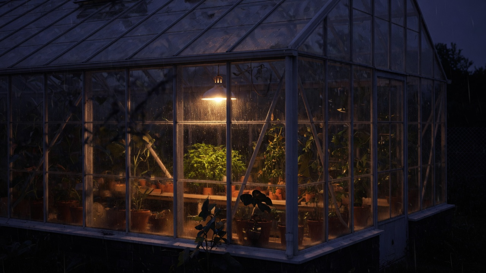

# 第十六章. Sandbox 服务与文件工具

控制平面可以调度，不该亲自 `rm -rf`。文件、命令、浏览器都放到另一进程里，挂载单独的卷，用同一把 API Key 说话。这个进程是 `backend/sandbox-ts`，Hono，默认 8100。

工作区根目录来自 `WORKSPACE_DIR`，Compose 里是 `/workspace`。请求带 `workspace` 和 `full_access`。假则只允许根下的子目录；真则整个挂载根。绝对路径、`..`、盘符穿越，一律 400。这不是客气，是唯一的边界。



列出、读、写、替换、删、下载，路径都先 `resolvePath`。写文件看 `MAX_FILE_WRITE_BYTES`，超了 413。读文件只返回前 `MAX_FILE_READ_BYTES`，并标明 `truncated`。删除不允许删掉工作区根本身。

```ts
resolvePath(path: string, workspace: string, fullAccess: boolean): string {
  const clean = path.trim() || ".";
  if (isAbsolutePath(clean)) {
    throw new SandboxError("absolute path is not allowed");
  }
  if (clean.split(/[\\/]/).includes("..")) {
    throw new SandboxError("path escapes workspace");
  }
  const root = this.root(workspace, fullAccess);
  const target = resolve(root, clean);
  if (!this.isInside(root, target)) {
    throw new SandboxError("path escapes workspace");
  }
  return target;
}
```

鉴权和 API 同一把钥匙：`X-Atlas-API-Key` 或 `atlas_session` cookie。`GET /api/status` 公开，给健康检查。其余全部要过门。Nginx 把浏览器的 `/sandbox-api/` 转到 8100 的 `/api/`。

```bash
cd backend/sandbox-ts
pnpm install
pnpm dev
curl http://127.0.0.1:8100/api/status
```

再 POST `/api/files/write`，body 里 `path`、`content`、`create_parent`。读回来应一字不差。用 `path: "../x"` 应失败。

---

[← 第十五章. 上下文工程](15-上下文工程.md) · [返回目录](../README.md) · [第十七章. Sandbox Shell 与 Docker 隔离 →](17-Sandbox%20Shell%20与%20Docker%20隔离.md)
